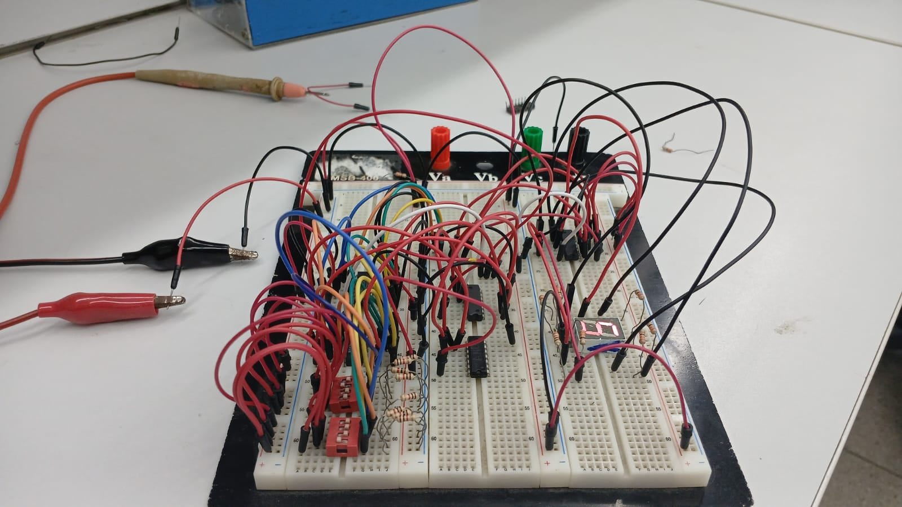
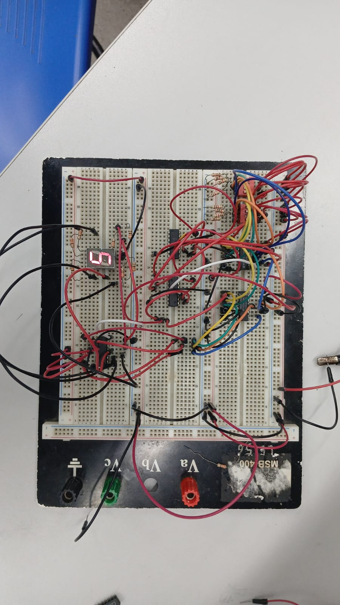
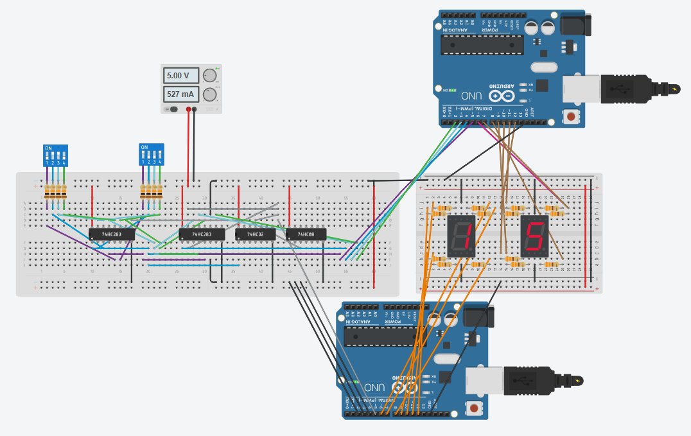

## Link do Projeto no Tinkercad
https://www.tinkercad.com/things/3nxzd4ioqzL-projeto1sdsomadorbcd7segshared

# Prática 1: Somador BCD em Protoboard

## Introdução

Para o primeiro projeto da disciplina, foi proposto a elaboração do projeto de um somador BCD para ser desenvolvido em protoboard, utilizando CI's comerciais disponíveis no laboratório.  
O esquemático do somador é mostrado abaixo. Sua implementação será discutida a seguir e está disponibilizada no livro [tocci].

## Referencial Teórico

### Somador 4 bits

Para realizar a soma, é necessário um circuito que faça a soma em binário. É possível construir um somador de 4 bits, colocando vários somadores de 1 bit em paralelo com os carrys em sequência.  
O somador de 4 bits é utilizado para somar os dois números binários, porém precisa de correção caso o valor exceda 9; para isso, desenvolve-se um circuito auxiliar usando outro somador de 4 bits.

### Circuito Auxiliar

Caso a soma exceda 9, é necessário corrigir o resultado do primeiro somador somando 6 condicionalmente. Isso é feito com base na tabela verdade abaixo:

| Decimal | $S_3$ | $S_2$ | $S_1$ | $S_0$ | $Y$ |
|---------|-------|-------|-------|-------|-----|
| 0 | 0 | 0 | 0 | 0 | 0 |
| 1 | 0 | 0 | 0 | 1 | 0 |
| 2 | 0 | 0 | 1 | 0 | 0 |
| 3 | 0 | 0 | 1 | 1 | 0 |
| 4 | 0 | 1 | 0 | 0 | 0 |
| 5 | 0 | 1 | 0 | 1 | 0 |
| 6 | 0 | 1 | 1 | 0 | 0 |
| 7 | 0 | 1 | 1 | 1 | 0 |
| 8 | 1 | 0 | 0 | 0 | 0 |
| 9 | 1 | 0 | 0 | 1 | 0 |
| 10 | 1 | 0 | 1 | 0 | 1 |
| 11 | 1 | 0 | 1 | 1 | 1 |
| 12 | 1 | 1 | 0 | 0 | 1 |
| 13 | 1 | 1 | 0 | 1 | 1 |
| 14 | 1 | 1 | 1 | 0 | 1 |
| 15 | 1 | 1 | 1 | 1 | 1 |

_Tabela: Tabela verdade para entrada de 4 bits_

Com isso, a condição $Y$ pode ser expressa como soma de produtos:

$$
Y = S_3\overline{S_2}S_1\overline{S_0} + S_3\overline{S_2}S_1S_0 + S_3S_2\overline{S_1}\overline{S_0} + S_3S_2\overline{S_1}S_0 + S_3S_2S_1\overline{S_0} + S_3S_2S_1S_0
$$

Simplificando via mapa de Karnaugh:

| $S_3S_2$ \ $S_1S_0$ | 00 | 01 | 11 | 10 |
|---------------------|----|----|----|----|
| 00                  |  0 |  0 |  0 |  0 |
| 01                  |  0 |  0 |  0 |  0 |
| 11                  |  1 |  1 |  1 |  1 |
| 10                  |  0 |  0 |  1 |  1 |

_Tabela: Mapa de Karnaugh_

Deste mapa, a saída Y é dada por:

$$
Y = S_3S_2 + S_3S_1 = S_3(S_1 + S_2)
$$

Esse circuito pode ser implementado com uma porta OR e uma porta AND apenas.

### Conversor para 7 segmentos

Para mostrar o número, é preciso converter cada dígito do número em BCD para decimal, ou seja, para um display de 7 segmentos.  
Isso pode ser feito com álgebra booleana, obtendo as expressões lógicas de cada LED a partir da tabela verdade:

| Decimal | A | B | C | D | a | b | c | d | e | f | g |
|---------|---|---|---|---|---|---|---|---|---|---|---|
| 0 | 0 | 0 | 0 | 0 | 1 | 1 | 1 | 1 | 1 | 1 | 0 |
| 1 | 0 | 0 | 0 | 1 | 0 | 1 | 1 | 0 | 0 | 0 | 0 |
| 2 | 0 | 0 | 1 | 0 | 1 | 1 | 0 | 1 | 1 | 0 | 1 |
| 3 | 0 | 0 | 1 | 1 | 1 | 1 | 1 | 1 | 0 | 0 | 1 |
| 4 | 0 | 1 | 0 | 0 | 0 | 1 | 1 | 0 | 0 | 1 | 1 |
| 5 | 0 | 1 | 0 | 1 | 1 | 0 | 1 | 1 | 0 | 1 | 1 |
| 6 | 0 | 1 | 1 | 0 | 1 | 0 | 1 | 1 | 1 | 1 | 1 |
| 7 | 0 | 1 | 1 | 1 | 1 | 1 | 1 | 0 | 0 | 0 | 0 |
| 8 | 1 | 0 | 0 | 0 | 1 | 1 | 1 | 1 | 1 | 1 | 1 |
| 9 | 1 | 0 | 0 | 1 | 1 | 1 | 1 | 1 | 0 | 1 | 1 |

_Tabela: Tabela verdade para display de 7 segmentos (0 a 9)_

Expressões lógicas simplificadas (via mapa de Karnaugh):
$$
- \( a = A + A'C +B'D' + BD \)
- \( b = A + C'D' + CD + A'B' \)
- \( c = A + BD' + CD + C' \)
- \( d = A + B'C'D' + CD' + A'B'C + BC'D \)
- \( e = B'C'D' + AC + AB + CD' \)
- \( f = A + C'D' + BD' + BC' \)
- \( g = A + BC' + CD' + B'C \)
$$
O CI 74HC48 realiza esta conversão para um display catódico, mas como não está disponível no Tinkercad, utilizou-se um Arduino UNO.

## Materiais e Métodos

### Materiais

| Componente | Quantidade |
|-------------------|-----------|
| CI 74HC283 (Somador 4 bits) | 2 |
| CI 74HC48 (Decodificador BCD–7 segmentos) | 2 |
| CI 74HC32 (Porta OR) | 1 |
| CI 74HC08 (Porta AND) | 1 |
| Display de 7 segmentos catódico | 2 |
| Resistores (560 Ω) | 14 |
| Resistores Pull Down (1 kΩ) | 8 |
| Protoboard | 1 |
| Jumpers | Diversos |
| Fonte de 5V | 1 |

_Tabela: Componentes utilizados na montagem do somador BCD_

## Implementação em Protoboard

A montagem foi feita em protoboard, conectando o CI 7483 para realizar a soma binária, e o CI 7447 para converter a saída em BCD para o display de 7 segmentos. Foram utilizados resistores para limitar a corrente nos LEDs, garantindo funcionamento seguro. A alimentação foi feita com fonte de 5V.

O circuito foi montado conforme o diagrama do somador BCD, conectando as entradas do CI 74HC283; se a soma excedesse 6, usava-se outro CI 74HC283 para fazer a correção (somar 6), em conjunto com portas OR e AND ilustradas na figura 2. O resultado corrigido era exibido após conversão pelo CI 7448.

Inicialmente exigia um segundo LED para exibir 1 ou 0 quando ultrapassava 9, mas um LED foi suficiente para validação.

A Figura 2 mostra a implementação em protoboard:

## Implementação no Tinkercad

A montagem foi realizada também no Tinkercad. Como não havia o CI 74HC48, utilizou-se um Arduino para converter BCD para display de 7 segmentos.

A figura abaixo mostra essa implementação:

O código para Arduino e o projeto Tinkercad estão disponíveis em:

https://github.com/PedroDS4/Laboratorio_Sistemas_Digitais/Projeto1

## Resultados e Discussão

Diversas entradas foram testadas e o funcionamento esperado foi confirmado: os valores binários somados foram corretamente exibidos no display. Pequenos erros de leitura ocorreram devido a mau contato, mas foram corrigidos.  
A prática validou a lógica do somador BCD e destacou a importância da organização na montagem.
