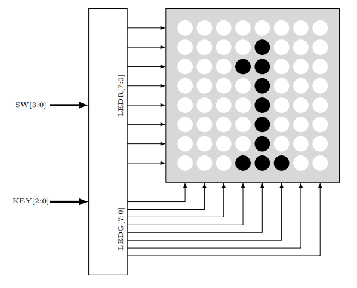
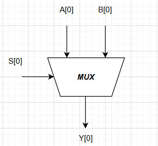
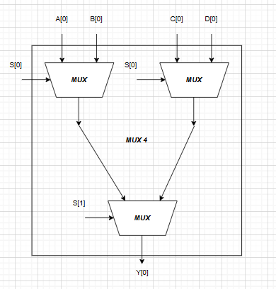
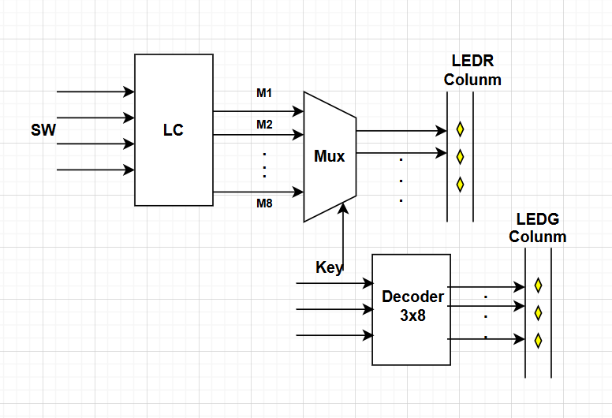
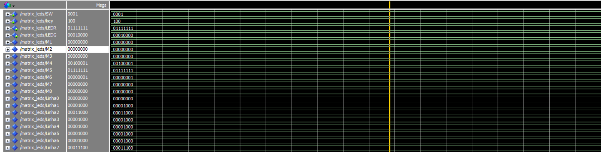
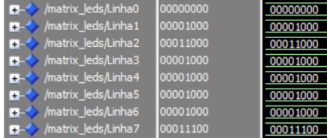

# Prática 2: Matriz de Leds

## Introdução

O segundo projeto proposto foi, em VHDL e implementação em FPGA, desenvolver a lógica de uma matriz de leds, cujo esquemático é mostrado abaixo:

## Referencial Teórico

### Matriz de Leds

A lógica dos leds da matriz pode ser obtida com lógica combinacional. Monta-se a tabela verdade para os 35 leds úteis, permitindo derivar expressões para cada led na forma de soma de produtos, mapeando entradas numéricas para padrões numéricos.

A chave de entrada \(SW\) pode ser mapeada para sinais produtos que serão utilizados nas expressões dos leds, assim:

$$
\begin{cases}
S_{0}  = \overline{SW_{3}}\ \overline{SW_{2}}\ \overline{SW_{1}}\ \overline{SW_{0}} \\
S_{1}  = \overline{SW_{3}}\ \overline{SW_{2}}\ \overline{SW_{1}}\ SW_{0} \\
S_{2}  = \overline{SW_{3}}\ \overline{SW_{2}}\ SW_{1}\ \overline{SW_{0}} \\
S_{3}  = \overline{SW_{3}}\ \overline{SW_{2}}\ SW_{1}\ SW_{0} \\
S_{4}  = \overline{SW_{3}}\ SW_{2}\ \overline{SW_{1}}\ \overline{SW_{0}} \\
S_{5}  = \overline{SW_{3}}\ SW_{2}\ \overline{SW_{1}}\ SW_{0} \\
S_{6}  = \overline{SW_{3}}\ SW_{2}\ SW_{1}\ \overline{SW_{0}} \\
S_{7}  = \overline{SW_{3}}\ SW_{2}\ SW_{1}\ SW_{0} \\
S_{8}  = SW_{3}\ \overline{SW_{2}}\ \overline{SW_{1}}\ \overline{SW_{0}} \\
S_{9}  = SW_{3}\ \overline{SW_{2}}\ \overline{SW_{1}}\ SW_{0} \\
S_{10} = SW_{3}\ \overline{SW_{2}}\ SW_{1}\ \overline{SW_{0}} \\
S_{11} = SW_{3}\ \overline{SW_{2}}\ SW_{1}\ SW_{0} \\
S_{12} = SW_{3}\ SW_{2}\ \overline{SW_{1}}\ \overline{SW_{0}} \\
S_{13} = SW_{3}\ SW_{2}\ \overline{SW_{1}}\ SW_{0} \\
S_{14} = SW_{3}\ SW_{2}\ SW_{1}\ \overline{SW_{0}} \\
S_{15} = SW_{3}\ SW_{2}\ SW_{1}\ SW_{0}
\end{cases}
$$

As equações para cada um dos 35 leds úteis, a partir dos sinais auxiliares \(S_i\), são:

$$
\begin{cases}
M_{23} = S_{5} + S_{7} + S_{11} \\
M_{24} = S_{0} + S_{2} + S_{3} + S_{5} + S_{7} + S_{8} + S_{9} \\
M_{25} = S_{0} + S_{1} + S_{2} + S_{3} + S_{5} + S_{6} + S_{7} + S_{8} + S_{9} \\
M_{26} = S_{0} + S_{2} + S_{3} + S_{4} + S_{5} + S_{6} + S_{7} + S_{8} + S_{9} + S_{15} \\
M_{27} = S_{5} + S_{7} + S_{13} \\
M_{33} = S_{0} + S_{2} + S_{3} + S_{5} + S_{8} + S_{9} + S_{11} \\
M_{34} = S_{1} + S_{6} \\
M_{35} = S_{1} + S_{4} + S_{15} \\
M_{36} = S_{4} \\
M_{37} = S_{0} + S_{2} + S_{3} + S_{7} + S_{8} + S_{9} + S_{13} + S_{15} \\
M_{43} = S_{0} + S_{5} + S_{6} + S_{8} + S_{9} + S_{11} \\
M_{44} = S_{4} + S_{5} + S_{10} + S_{12} + S_{13} + S_{14} \\
M_{45} = S_{1} + S_{5} + S_{10} + S_{11} + S_{12} + S_{13} + S_{14} + S_{15} \\
M_{46} = S_{0} + S_{4} + S_{5} + S_{7} + S_{11} + S_{12} + S_{14} \\
M_{47} = S_{0} + S_{2} + S_{3} + S_{8} + S_{9} + S_{13} \\
M_{53} = S_{0} + S_{4} + S_{6} + S_{11} + S_{12} + S_{13} + S_{14} \\
M_{54} = S_{3} + S_{6} + S_{8} + S_{9} + S_{11} + S_{15} \\
M_{55} = S_{0} + S_{1} + S_{2} + S_{3} + S_{6} + S_{7} + S_{8} + S_{9} + S_{15} \\
M_{56} = S_{2} + S_{3} + S_{4} + S_{6} + S_{8} + S_{9} + S_{10} + S_{13} + S_{15} \\
M_{57} = S_{0} + S_{5} + S_{9} + S_{11} + S_{13} + S_{14} \\
M_{63} = S_{0} + S_{4} + S_{6} + S_{8} + S_{11} + S_{12} + S_{13} + S_{14} \\
M_{64} = S_{0} + S_{2} + S_{4} + S_{7} + S_{10} + S_{14} \\
M_{65} = S_{1} + S_{4} + S_{10} + S_{14} + S_{15} \\
M_{66} = S_{4} + S_{10} + S_{14} \\
M_{67} = S_{0} + S_{3} + S_{4} + S_{5} + S_{6} + S_{8} + S_{9} + S_{11} + S_{13} \\
M_{73} = S_{0} + S_{2} + S_{3} + S_{5} + S_{6} + S_{8} + S_{10} + S_{11} + S_{12} + S_{13} + S_{14} \\
M_{74} = S_{7} \\
M_{75} = S_{1} + S_{15} \\
M_{76} = S_{4} + S_{9} + S_{10} \\
M_{77} = S_{0} + S_{3} + S_{5} + S_{6} + S_{8} + S_{11} + S_{12} + S_{13} \\
M_{83} = S_{2} + S_{11} \\
M_{84} = S_{0} + S_{1} + S_{2} + S_{3} + S_{5} + S_{6} + S_{7} + S_{8} + S_{9} + S_{10} + S_{11} + S_{12} + S_{13} + S_{14} \\
M_{85} = S_{0} + S_{1} + S_{2} + S_{3} + S_{5} + S_{6} + S_{8} + S_{9} + S_{10} + S_{11} + S_{12} + S_{13} + S_{14} + S_{15} \\
M_{86} = S_{0} + S_{1} + S_{2} + S_{3} + S_{4} + S_{5} + S_{6} + S_{8} + S_{10} + S_{11} + S_{12} + S_{13} + S_{14} \\
M_{87} = S_{2} + S_{10} + S_{13}
\end{cases}
$$

---

### Multiplexador Simples

Um multiplexador 2:1 possui duas entradas de dados (\(I_0\) e \(I_1\)), uma linha de seleção \(S\), e uma única saída \(Y\).

A tabela verdade é:

| S | \(I_0\) | \(I_1\) | Y |
|---|---------|---------|---|
| 0 | 0 | 0 | 0 |
| 0 | 0 | 1 | 0 |
| 0 | 1 | 0 | 1 |
| 0 | 1 | 1 | 1 |
| 1 | 0 | 0 | 0 |
| 1 | 0 | 1 | 1 |
| 1 | 1 | 0 | 0 |
| 1 | 1 | 1 | 1 |

Expressão em soma de produtos:

$$
Y = S' I_0 I_1' + S' I_0 I_1 + S I_0' I_1 + S I_0 I_1
$$

Simplificando usando álgebra booleana:

$$
Y = S' I_0 (I_1' + I_1) + S I_1 (I_0' + I_0) = S' I_0 + S I_1
$$

### Multiplexador de 8 Canais

Para multiplexar as operações em paralelo e obter uma saída única conforme a chave, usa-se multiplexadores simples agrupados para formar multiplexadores de 4 e 8 canais.

Esquemático do multiplexador de 4 canais:

Multiplexador de 8 canais montado com dois multiplexadores de 4 canais e um simples:

### Decodificador 3x8 com Enable

Para multiplexar colunas da matriz, utiliza-se um decodificador 3x8 com entrada SW e enable em nível alto.

Tabela verdade:

| en | s3 | s2 | s1 | s0 | d7 | d6 | d5 | d4 | d3 | d2 | d1 | d0 |
|----|----|----|----|----|----|----|----|----|----|----|----|----|
| 1  | 0  | 0  | 0  | 0  | 0  | 0  | 0  | 0  | 0  | 0  | 0  | 1  |
| 1  | 0  | 0  | 0  | 1  | 0  | 0  | 0  | 0  | 0  | 0  | 1  | 0  |
| 1  | 0  | 0  | 1  | 0  | 0  | 0  | 0  | 0  | 0  | 1  | 0  | 0  |
| 1  | 0  | 0  | 1  | 1  | 0  | 0  | 0  | 0  | 1  | 0  | 0  | 0  |
| 1  | 0  | 1  | 0  | 0  | 0  | 0  | 0  | 1  | 0  | 0  | 0  | 0  |
| 1  | 0  | 1  | 0  | 1  | 0  | 0  | 1  | 0  | 0  | 0  | 0  | 0  |
| 1  | 0  | 1  | 1  | 0  | 0  | 1  | 0  | 0  | 0  | 0  | 0  | 0  |
| 1  | 0  | 1  | 1  | 1  | 1  | 0  | 0  | 0  | 0  | 0  | 0  | 0  |
| X  | X  | X  | X  | X  | 0  | 0  | 0  | 0  | 0  | 0  | 0  | 0  |

Expressões lógicas para as saídas \(d\):

$$
\begin{cases}
d_0 = e_n \cdot s_2' \cdot s_1' \cdot s_0' \\
d_1 = e_n \cdot s_2' \cdot s_1' \cdot s_0 \\
d_2 = e_n \cdot s_2' \cdot s_1 \cdot s_0' \\
d_3 = e_n \cdot s_2' \cdot s_1 \cdot s_0 \\
d_4 = e_n \cdot s_2 \cdot s_1' \cdot s_0' \\
d_5 = e_n \cdot s_2 \cdot s_1' \cdot s_0 \\
d_6 = e_n \cdot s_2 \cdot s_1 \cdot s_0' \\
d_7 = e_n \cdot s_2 \cdot s_1 \cdot s_0 \\
\end{cases}
$$

## Materiais e Métodos

### Materiais

| Componente     | Quantidade |
|----------------|------------|
| FPGA Cyclone II| 1          |

## Métodos

Para a concepção do circuito, foram utilizados os componentes descritos matematicamente acima, cada um com sua lógica deduzida. O circuito final é mostrado abaixo:

O componente LC transmite a lógica para acender cada led conforme a entrada, mapeada para sinais \(M_i\) que representam as colunas da matriz de leds. Essas equações foram mostradas anteriormente, e a dedução via tabela verdade está disponível na planilha no GitHub, que será disponibilizada na seção de Simulação.

## Implementação Na FPGA

A simulação na FPGA foi realizada, simulando os números de 0 a 9. Observou-se o padrão visual de cada coluna conforme o valor das chaves \([KEY]\). O funcionamento do circuito foi confirmado.

## Simulação no ModelSIM

Para a simulação, foi criado um arquivo script .do definindo:

$$
\begin{cases}
SW = 0001 \\
key = 001
\end{cases}
$$

Assim, a matriz de leds mostraria o padrão visual do número 1, como confirmado nas imagens abaixo:

Os códigos VHDL desenvolvidos estão disponíveis no GitHub:

https://github.com/PedroDS4/Laboratorio_Sistemas_Digitais/Projeto2

## Resultados e Discussão

Testaram-se entradas e verificou-se o padrão numérico esperado na saída conforme o enunciado. As equações dos leds foram feitas manualmente e não simplificadas devido à quantidade.
