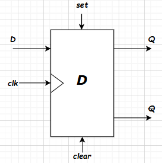

Link da implementação virtual no TinkerCAD: https://www.tinkercad.com/things/laWzrBB5k3X-projeto2sdlabmdetinkercadshared

# Prática 3: Máquina de Estados Finitos

## Introdução

Para o terceiro projeto da disciplina, foi proposto a elaboração do projeto de uma FSM em protoboard, utilizando os CI's comerciais de flip-flops JK ou D. A FSM é mostrada abaixo:

## Referencial Teórico

### Flip-Flop JK

O flip-flop J-K tem a prioridade de aprimorar o funcionamento circuito flip-flop R-S interpretando a condição \( S = R = 1 \) como um comando de inversão [tocci]. Especificamente:

- \( J = 1, K = 0 \): comando para ativar (*set*) a saída
- \( J = 0, K = 1 \): comando para desativar (*reset*) a saída
- \( J = K = 1 \): comando para inverter

A equação característica do Flip-Flop JK é:

$$
Q^{i+1} = J\ \overline{Q^i} + \overline{K}\ Q^{i}
$$

Outra característica interessante do Flip-Flop JK é que ele pode dividir a frequência do sinal digital da entrada, funcionando como divisor de frequência.

### Flip-Flop D

O flip-flop D é um circuito utilizado em registradores, com a função de armazenar bits seletivamente [tocci]. A equação característica do flip-flop D é:

$$
Q^{i+1} = D \cdot clk^{\uparrow}
$$

Ou seja, a saída é igual à entrada nas bordas de subida do clock.

### Conversor para 7 segmentos

Para mostrar o número no display de 7 segmentos, é necessário converter de BCD para decimal. Abaixo está a tabela verdade:

| Decimal | A | B | C | D | a | b | c | d | e | f | g |
|---------|---|---|---|---|---|---|---|---|---|---|---|
| 0 | 0 | 0 | 0 | 0 | 1 | 1 | 1 | 1 | 1 | 1 | 0 |
| 1 | 0 | 0 | 0 | 1 | 0 | 1 | 1 | 0 | 0 | 0 | 0 |
| 2 | 0 | 0 | 1 | 0 | 1 | 1 | 0 | 1 | 1 | 0 | 1 |
| 3 | 0 | 0 | 1 | 1 | 1 | 1 | 1 | 1 | 0 | 0 | 1 |
| 4 | 0 | 1 | 0 | 0 | 0 | 1 | 1 | 0 | 0 | 1 | 1 |
| 5 | 0 | 1 | 0 | 1 | 1 | 0 | 1 | 1 | 0 | 1 | 1 |
| 6 | 0 | 1 | 1 | 0 | 1 | 0 | 1 | 1 | 1 | 1 | 1 |
| 7 | 0 | 1 | 1 | 1 | 1 | 1 | 1 | 0 | 0 | 0 | 0 |
| 8 | 1 | 0 | 0 | 0 | 1 | 1 | 1 | 1 | 1 | 1 | 1 |
| 9 | 1 | 0 | 0 | 1 | 1 | 1 | 1 | 1 | 0 | 1 | 1 |

**Tabela:** Tabela verdade para display de 7 segmentos (0 a 9)

A lógica pode ser obtida e simplificada usando mapas de Karnaugh, resultando nas expressões:

- \( a = A + A'C +B'D' + BD \)
- \( b = A + C'D' + CD + A'B' \)
- \( c = A + BD' + CD + C' \)
- \( d = A + B'C'D' + CD' + A'B'C + BC'D \)
- \( e = B'C'D' + AC + AB + CD' \)
- \( f = A + C'D' + BD' + BC' \)
- \( g = A + BC' + CD' + B'C \)

O CI 74HC48 faz essa conversão para display catódico, porém no Tinkercad utilizou-se um Arduino UNO.

### Tabela de Implicação

Foi feita a tabela de implicação para a FSM, de forma a observar se existem estados iguais para reduzir complexidade.

Pela tabela, as únicas células verdadeiras são B x D e E x F.

- Célula B x D: D = D; A = A; E = E; F = E.
- Célula E x F: B = B; F = E; D = D; F = E.

Conclusão: **E e F são equivalentes / B e D são equivalentes**.

A MDE simplificada é mostrada abaixo:

## Materiais e Métodos

### Materiais

| Componente | Quantidade |
|---|---|
| CI 74HC08 (Porta AND) | 2 |
| CI 74HC04 (Porta NOT) | 1 |
| CI 74HC32 (Porta OR) | 1 |
| CI 74HC48 (Decodificador BCD–7 segmentos) | 1 |
| CI 74HC74 (Flip-Flop tipo D) | 1 |
| Display de 7 segmentos catódico | 1 |
| Fonte de tensão | 1 |
| Gerador de sinais | 1 |
| Resistores Pull Down (10 kΩ) | 4 |
| Resistores (330 Ω) | 7 |

### Métodos

A implementação do circuito utilizou a seguinte codificação de estados:

$$
\begin{cases}
A = 00 \\
D = 01 \\
E = 10 \\
C = 11
\end{cases}
$$

A lógica de sequência é feita por sinais intermediários dos produtos entre os sinais de entrada \(u, y\) e os do estado atual \(S_1, S_0\):

$$
\begin{cases}
z = S_0 \\
T_1 = uS_0 + yS_1 \\
T_2 = uS_1'S_0' + u'y'S_0 + y'S_1 \\
S_0 = f_D(T_0) \\
S_1 = f_D(T_1)
\end{cases}
$$

Onde \(f_D\) é a função interna do flip-flop D. O circuito final está abaixo:

## Implementação em Protoboard

Para a montagem em protoboard, foram utilizados os CI's destacados na seção de materiais e métodos, onde inicialmente foram feitas os termos formados a partir de portas $AND$, depois conectados os flip-flops, e por último a porta $OR$, que resultou nos estados e nas saídas na forma de soma de produtos.
Assim

$$
    \begin{cases}
        t_1 = uS_0 \\
        t_2 = yS_1 \\
        t_3 = uS_1' \\
        t_4 = u'y' \\
        t_5 = y'S_1
    \end{cases}
$$

então os estados e as saidas foram dados por

$$
    \begin{cases}
        z = S_0 \\
        S_0 = t_1 + t_2 \\
        S_1 = t_3 \cdot S_0' + t_4 \cdot S_0 + t_5
    \end{cases}
$$

Assim fica fácil ver porque o número necessário de portas $AND$ foram 7, e o número necessário de portas $OR$ foram 3, além do número de portas $NOT$ ser 2, ja que os estados barrados foram tirados do próprio flip-flop D.
Porém a implementação em protoboard não funcionou como o esperado, devido a flutuações e sensibilidade dos jumpers utilizados.

## Implementação no Tinkercad

A montagem seguiu a mesma lógica no Tinkercad. Como o CI 74HC48 não existe na plataforma, utilizou-se um Arduino para a conversão BCD para display de 7 segmentos.

O sinal de clock foi uma onda quadrada com amplitude \(A = 5~V\), deslocamento \(V_{dc} = 2.5~V\) e frequência \(f = 1~Hz\), servindo apenas níveis lógicos de \(5~V\) ou \(0~V\).

Ao ligar, o circuito vai para o estado inicial A; para avançar para o próximo estado, a entrada \(u\) é colocada em 1, indo para \(D = 01\).

O código Arduino e a cópia do projeto Tinkercad estão disponíveis em:

https://github.com/PedroDS4/Laboratorio_Sistemas_Digitais/Projeto1

## Conclusão

Todas as transições de estados foram testadas em ambas implementações, e foi verificado que o circuito seguiu corretamente a lógica da máquina de estados proposta.
