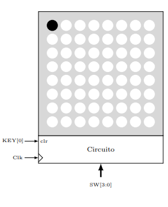
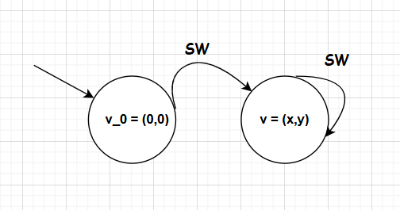
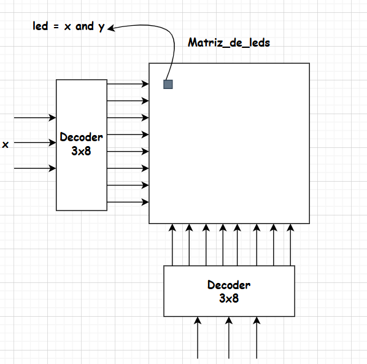
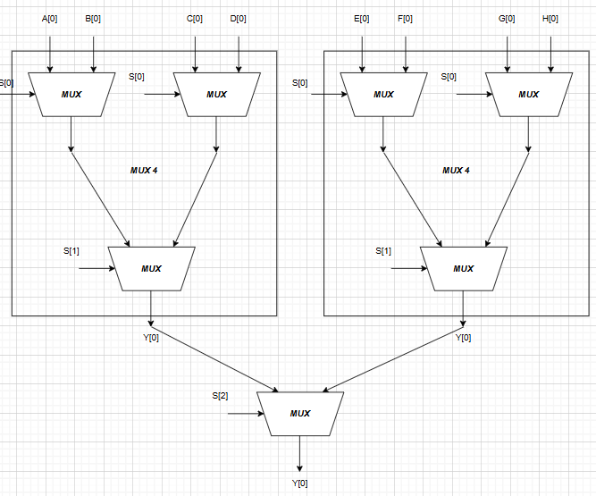
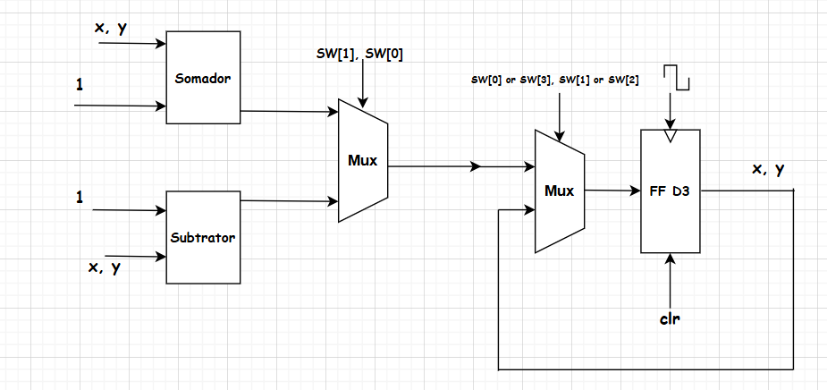
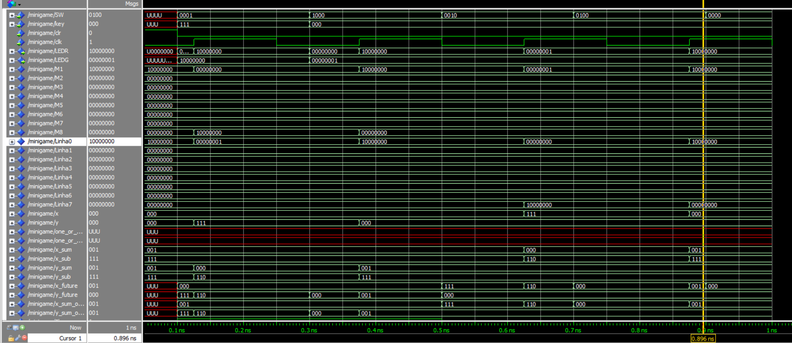
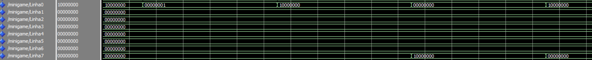

# Prática 4: Minigame

## Introdução

O segundo projeto proposto foi o desenvolvimento, em **VHDL** e a implementação em **FPGA**, da lógica de uma **matriz de LEDs**, cujo esquemático é mostrado abaixo:

## Referencial Teórico

### Mini-game

O minigame proposto consiste no **controle da posição de um LED** em uma matriz, onde, a partir da entrada `SW` de 3 bits, a posição do LED atual pode ser controlada para **cima, baixo, direita ou esquerda**, de acordo com o padrão:

$$
\begin{cases}
SW[3] = \rightarrow \\
SW[0] = \leftarrow \\
SW[1] = \uparrow \\
SW[2] = \downarrow
\end{cases}
$$

Além disso, o circuito possui uma entrada `clr` mapeada para `KEY[0]`, que retorna o LED à sua posição inicial $(x = 0, y = 0)$.

Podemos então construir uma **máquina de estados** para esse minigame, que seria uma máquina teórica com **64 estados**, precisando de **6 flip-flops** para realizá-la. No entanto, podemos deixar o estado inicial para a origem $(0,0)$ e codificar os 63 estados como $v = (x,y)$, com a lógica de transição entre os estados determinada pela entrada `SW`, como mostrado abaixo:

Para acender os LEDs, foram utilizados **dois decodificadores**, que, para cada posição, acendem uma linha e uma coluna. Assim, apenas o LED na **interseção** dessas duas é ativado, como mostrado a seguir:

A lógica de ativação de um LED na posição $(x, y)$ pode ser dada por:

$$
L(i, j) = i \cdot j = i \text{ and } j
$$

onde:

$$
\begin{cases}
i = f_d(x) \\
j = f_d(y)
\end{cases}
$$

A função combinacional $f_d$ representa o **decodificador 3x8**.  
O diagrama de blocos que implementa a lógica de atualização das posições será mostrado na seção de **Metodologia**.

---

### Multiplexador Simples

Um **multiplexador 2:1** possui duas entradas de dados (`I0` e `I1`), uma linha de seleção `S` e uma saída `Y`.

A tabela verdade é:

| **S** | **I₀** | **I₁** | **Y** |
|:-----:|:------:|:------:|:-----:|
| 0 | 0 | 0 | 0 |
| 0 | 0 | 1 | 0 |
| 0 | 1 | 0 | 1 |
| 0 | 1 | 1 | 1 |
| 1 | 0 | 0 | 0 |
| 1 | 0 | 1 | 1 |
| 1 | 1 | 0 | 0 |
| 1 | 1 | 1 | 1 |

A expressão lógica é:

$$
Y = S'I_0I_1' + S'I_0I_1 + SI_0'I_1 + SI_0I_1
$$

Simplificando pela álgebra booleana:

$$
Y = S'I_0 + SI_1
$$

---

## Multiplexador de 8 Canais

Como todas as operações descritas serão feitas **em paralelo**, é necessário que apenas **uma saída** seja selecionada pela chave.  
O **multiplexador** é o componente que realiza essa seleção.

Para obter um **multiplexador de 4 canais**, utilizamos dois multiplexadores 2:1 em paralelo e um em série:

Para um **multiplexador de 8 canais**, combinamos dois multiplexadores de 4 canais com um simples, conforme mostrado:

---

## Decodificador 3x8 com Enable

Para multiplexar as colunas da matriz, usamos um **decodificador 3x8** que recebe a chave `SW` e um sinal de **enable** sempre em nível alto.

| e_n | s3 | s2 | s1 | s0 | d7 | d6 | d5 | d4 | d3 | d2 | d1 | d0 |
|:---:|:--:|:--:|:--:|:--:|:--:|:--:|:--:|:--:|:--:|:--:|:--:|:--:|
| 1 | 0 | 0 | 0 | 0 | 0 | 0 | 0 | 0 | 0 | 0 | 0 | 1 |
| 1 | 0 | 0 | 0 | 1 | 0 | 0 | 0 | 0 | 0 | 0 | 1 | 0 |
| 1 | 0 | 0 | 1 | 0 | 0 | 0 | 0 | 0 | 0 | 1 | 0 | 0 |
| 1 | 0 | 0 | 1 | 1 | 0 | 0 | 0 | 0 | 1 | 0 | 0 | 0 |
| 1 | 0 | 1 | 0 | 0 | 0 | 0 | 0 | 1 | 0 | 0 | 0 | 0 |
| 1 | 0 | 1 | 0 | 1 | 0 | 0 | 1 | 0 | 0 | 0 | 0 | 0 |
| 1 | 0 | 1 | 1 | 0 | 0 | 1 | 0 | 0 | 0 | 0 | 0 | 0 |
| 1 | 0 | 1 | 1 | 1 | 1 | 0 | 0 | 0 | 0 | 0 | 0 | 0 |
| X | X | X | X | X | 0 | 0 | 0 | 0 | 0 | 0 | 0 | 0 |

As expressões lógicas de saída são:

$$
\begin{cases}
d_0 = e_n \cdot s_2' \cdot s_1' \cdot s_0' \\
d_1 = e_n \cdot s_2' \cdot s_1' \cdot s_0 \\
d_2 = e_n \cdot s_2' \cdot s_1 \cdot s_0' \\
d_3 = e_n \cdot s_2' \cdot s_1 \cdot s_0 \\
d_4 = e_n \cdot s_2 \cdot s_1' \cdot s_0' \\
d_5 = e_n \cdot s_2 \cdot s_1' \cdot s_0 \\
d_6 = e_n \cdot s_2 \cdot s_1 \cdot s_0' \\
d_7 = e_n \cdot s_2 \cdot s_1 \cdot s_0
\end{cases}
$$

---

## Materiais e Métodos

### Materiais

| Componente | Quantidade |
|:------------|:------------:|
| FPGA Cyclone II | 1 |

### Métodos

Para o circuito, foram usados 6 **flip-flops** — dois registradores de 3 bits (para `x` e `y`), além da lógica de soma e subtração conforme o movimento.  
O **mux de bypass** controla se a posição é atualizada ou não.

O mux de bypass é **realimentado** com sua própria saída, junto à saída de soma/subtração — funcionando como um **registrador de carga paralela**.

---

## Implementação na FPGA

O circuito foi testado na FPGA, simulando a sequência usada no **ModelSim**.  
O padrão de movimento da matriz foi verificado a partir das chaves `[KEY]`, e o **funcionamento foi confirmado pelo professor**.

---

## Simulação no ModelSim

Foi criado um **script `.do`** com a seguinte sequência:

$$
\begin{cases}
\leftarrow \ SW = 0001, \text{ se } t = 0.15 \ s \\
\rightarrow \ SW = 1000, \text{ se } t = 0.55 \ s \\
\uparrow \ SW = 0010, \text{ se } t = 0.6 \ s \\
\downarrow \ SW = 0100, \text{ se } t = 0.85 \ s
\end{cases}
$$

Para facilitar a visualização, foram criados **sinais representando as linhas da matriz**, mostrando as transições dos pixels.

Ao final da sequência, o ponto retorna à posição inicial.

Os códigos VHDL estão disponíveis no GitHub:

🔗 [Repositório do Projeto](https://github.com/PedroDS4/Laboratorio_Sistemas_Digitais/Pr)
