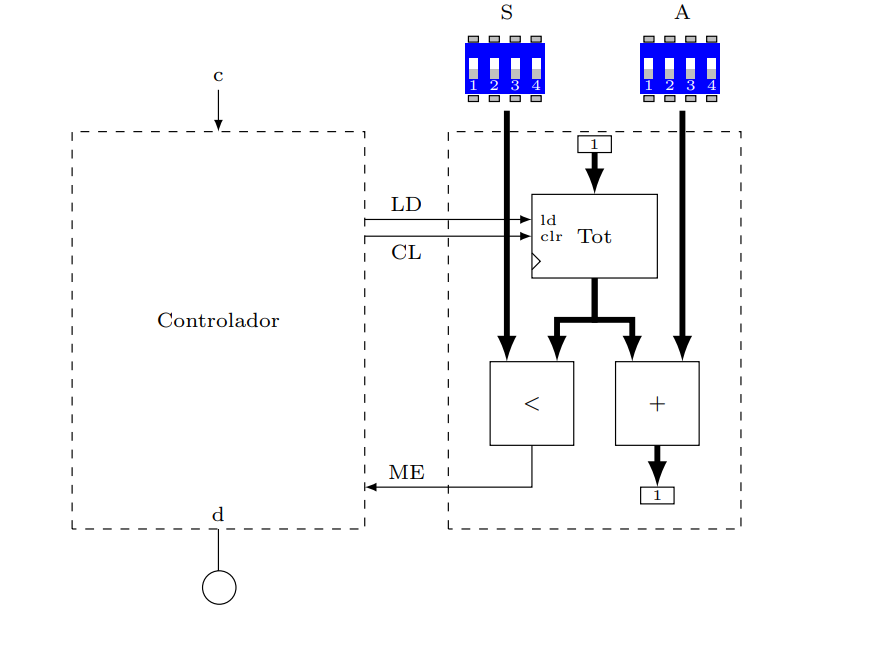
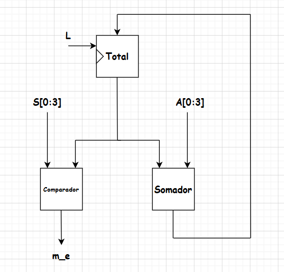
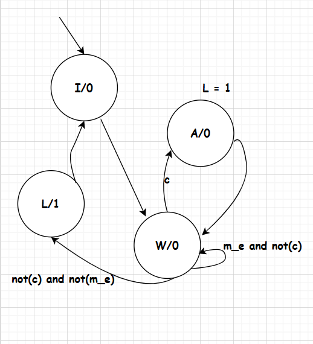

##**Link do tinkercad:**

# 📄 Prática 5: Maquina de Vendas

## Introdução
Para o terceiro projeto da disciplina, foi proposto a elaboração de um projeto RTL de uma **máquina de vendas**. A máquina possui duas entradas de dados, sendo uma para informar o valor da moeda inserida (**A[3:0]**) e uma outra para entrar com o valor do produto (**S[3:0]**). Também conta uma entrada para indicar quando uma moeda foi depositada (**c=1**) e uma saída (**d=1**) para liberar o produto. O circuito deve ser implementado através de circuitos integrados comerciais e pode fazer uso de quaisquer CIs da série 7400.

---

## Referencial Teórico
Para a concepção do projeto RTL, precisamos de alguns blocos operacionais para a lógica da máquina de vendas, como um **somador de 4 bits**, um **comparador de magnitude** e **registradores**, que podem ser feitos a partir de flip flops.

---

## Comparador Sequencial de 1 bit 
Um comparador sequencial de 1 bit é um componente capaz de verificar se uma cadeia de bits é igual, menor ou maior que uma referência, tendo esses três sinais de saída para e sinais de entradas correspondes as cadeias mais a esquerda.
Podemos montar uma tabela para um comparador desse tipo, e em seguida, podemos utilizar a soma de produtos para obter expressões lógicas para esse comparador, e o comparador de 10 bits pode ser feito cascateando vários desses comparadores.
As expressões lógicas para as saídas de comparação são mostradas abaixo:

Um comparador sequencial de 1 bit é um circuito capaz de comparar dois bits ($A$ e $B$) e, com base no resultado da comparação dos bits menos significativos (fornecidos pelas entradas de propagação), determinar se a cadeia de bits representada por $A$ é maior, menor ou igual à representada por $B$.

Esse comparador possui três entradas de propagação:
* `in_gt`: sinal indica que, até o bit anterior, $A > B$;
* `in_eq`: sinal indica que, até o bit anterior, $A = B$;
* `in_lt`: sinal indica que, até o bit anterior, $A < B$.

As saídas indicam o resultado da comparação após considerar o bit atual e são:
* `out_gt`: resultado final $A > B$;
* `out_eq`: resultado final $A = B$;
* `out_lt`: resultado final $A < B$.

A Tabela abaixo apresenta a tabela verdade de um comparador sequencial de 1 bit.

| A | B | `in_gt` | `in_eq` | `in_lt` | `out_gt` | `out_eq` | `out_lt` |
| :---: | :---: | :---: | :---: | :---: | :---: | :---: | :---: |
| 0 | 0 | 0 | 1 | 0 | 0 | 1 | 0 |
| 0 | 0 | 1 | 0 | 0 | 1 | 0 | 0 |
| 0 | 0 | 0 | 0 | 1 | 0 | 0 | 1 |
| 0 | 1 | x | x | x | 0 | 0 | 1 |
| 1 | 0 | x | x | x | 1 | 0 | 0 |
| 1 | 1 | 0 | 1 | 0 | 0 | 1 | 0 |
| 1 | 1 | 1 | 0 | 0 | 1 | 0 | 0 |
| 1 | 1 | 0 | 0 | 1 | 0 | 0 | 1 |

*Tabela: Tabela Verdade do Comparador Sequencial de 1 Bit com Propagação*

Com base na tabela, podemos escrever as expressões lógicas para cada saída utilizando a forma de soma de produtos:

* `out_gt` $= (A \cdot \overline{B}) + (\overline{A} \cdot \overline{B} \cdot$ `in_gt`) + (A \cdot B \cdot$ `in_gt`$)$
* `out_eq` $= (\overline{A} \cdot \overline{B} + A \cdot B) \cdot$ `in_eq`
* `out_lt` $= (\overline{A} \cdot B) + (\overline{A} \cdot \overline{B} \cdot$ `in_lt`) + (A \cdot B \cdot$ `in_lt`$)$

Essas expressões são utilizadas na construção de comparadores maiores (por exemplo, de 10 bits), conectando comparadores de 1 bit em cascata da direita para a esquerda (do bit menos significativo ao mais significativo), propagando os sinais de comparação apropriados.

---

## Somador de 4 bits
Utilizando o componente somador completo de 1 bit, é possível, cascateando n somadores em série, fazer um somador justamente de n bits, que nesse caso $n = 4$, como é mostrado abaixo

### Flip-Flop D
O **flip-flop D** é um circuito muito utilizado na construção de registradores simples, e tem a função de armazenar bits de forma seletiva.
A equação característica do flip-flop D é dada por

$$
Q^{i+1} = D \cdot clk ^{\uparrow}
$$

ou seja, ele é igual a sua entrada, nas bordas de subida do sinal de relógio.

A figura do flip-flop D é mostrada abaixo

---

## Registradores
Um **registrador** é um circuito feito para guardar o valor de um bit no seu interior até que ele mude, para isso precisamos de circuitos flip flops e também multiplexadores para controlar quando um registrador deve ser alterado(carregado) e quando deve permanecer com o mesmo valor.
Podemos implementar um registrador utilizando um Flip-flop D e um multiplexador, como é mostrado na figura abaixo.

A chave seletora do mux de um registrador é chamada de *load*, e seu nome tem justamente o significado de carregar um valor para a saída do registrador, somente quando essa chave for ativa.

A equação do multiplexador é dada por

$$
D = \overline{ load } \cdot Q + load \cdot I
$$

Porém a saída do registrador é o valor da entrada,a apenas nas bordas de subida, assim

$$
Q^{i+1} = (\overline{ load } \cdot Q^i + load \cdot I) \cdot clk^{\uparrow}
$$

Ou seja, o valor $Q$ guardado no registrador so vai ser determinado pela entrada I quando a entrada $load$ estiver ativa e houver uma borda de subida, e isso é a forma fundamental de armazenamento de bits, que é conhecido como **registrador de carga paralela**.

---

## Datapath
Foi desenvolvida uma arquitetura para o **datapath** baseado na operação de dar o troco das moedas aos poucos, e foram utilizados componentes como subtratores, multiplexadores, comparadores e registradores.

O diagrama de blocos do datapath é mostrado abaixo:

---

## Máquina de Estados (Controlador)

Foi feito uma **Máquina de Estados** para identificar o funcionamento da máquina de troco. Segue abaixo a figura:

---

## Materiais e Métodos

### Materiais

| Componente | Quantidade |
| :---: | :---: |
| CI 74HC08 (Porta AND) | 2 |
| CI 74HC04 (Porta NOT) | 1 |
| CI 74HC32 (Porta OR) | 1 |
| CI 74HC283 (Somador 4 Bits) | 1 |
| CI 74HC74 (2 Flip Flop D) | 2 |
| CI 74HC85(Comparador) | 1 |
| CI 74HC175(FFD 4b) + CI 74157(MUX 4b)(Registrador com Mux e FFD) | 1 |
| DIP SWITCH 4 bits | 2 |
| Fonte de tensão | 1 |
| Gerador de sinais | 1 |
| Led | 1 |
| Resistor para led(550 $\Omega$ | 1 |
| Resistores Pull Down (1 k$\Omega$) | 8 |

*Tabela: Componentes utilizados na montagem do Projeto.*

### Métodos
Para a implementação do circuito, foi utilizada a seguinte codificação de estados para o controlador

$$
\begin{cases}
I = 00 \\
A = 01 \\
W = 10 \\
L = 11
\end{cases}
$$

Para obter-se as expressões lógicas, foi feita a tabela verdade de acordo com o funcionamento da máquina de vendas, a maquina de estados e o datapath para as operações com os dados, e obteu-se as seguintes expressões:

$$
\begin{cases}
d = S_1S_0 \\
T_1 = \overline{S_1}S_0(\overline{m_e}+c) \\
T_0 = \overline{S_0} + \overline{S_1}\overline{c} \\
C_L = \overline{S_1}\overline{S_0} \\
L = S_1\overline{S_0} \\
S_0 = f_D(T_0) \\
S_1 = f_D(T_1)
\end{cases}
$$

onde $f_D$ representa a função interna de um flip-flop D, que foi utilizado neste projeto para fazer a lógica dos estados, e $T_1T_0$ são as entradas de cada um desses flip-flops, o circuito final é mostrado abaixo:

Onde o controlador pode ser implementado puramente com lógica combinacional e flip-flops D, definido pelas expressões descritas acima.

Para testar o circuito, foi feita a seguinte sequência de comandos

$$
\begin{cases}
c \rightarrow 1 \\
V_d \rightarrow 0011 \\
V_m \rightarrow 0001
\end{cases}
$$
o que na prática significou a adição de 3 moedas de valor $V_d = 1$, e a seguinte transição de estados aconteceu

$$
\begin{cases}
S_1S_0 = 00 \rightarrow S_1S_0 = 01 \\ \rightarrow
S_1S_0 = 10 \rightarrow S_1S_0 = 01 \\
\rightarrow S_1S_0 = 10 \rightarrow S_1S_0 = 01 \\
\rightarrow
S_1S_0 = 10 \rightarrow S_1S_0 = 01 \\
c \rightarrow 0 \\
\rightarrow S_1S_0 = 11 \rightarrow S_1S_0 = 00
\end{cases}
$$

para encerrar o funcionamento do circuito, parar a entrada de detecção de moedas, $c \rightarrow 0$, e o circuito volta para o estado inicial após liberar o produto e logo depois para o estado de espera de moedas novamente.

---

## Implementação no Logisim
Para testar se a lógica do circuito estava correta e a máquina de estados transitando entre os estados na sequência esperada.
Para isso, foram confeccionados os subcomponentes no Software **Logisim**, desde o somador de 1bit, até o registrador de 4 bits utilizado, com exceção do comparador de magnitude.
O circuito foi então simulado e mostrou a sequência de operações corretas, liberando a moeda assim que se chegou no estado $S_1S_0 = 11$, essa simulação se encontra no github do projeto, mostrado abaixo:

[https://github.com/PedroDS4/Laboratorio_de_Sistemas_Digitais/tree/main/Projeto5](https://github.com/PedroDS4/Laboratorio_de_Sistemas_Digitais/tree/main/Projeto5)

onde se tem um vídeo com a simulação e o arquivo **.circ** do Logisim.

---

## Implementação no Tinkercad
A montagem foi realizada no **tinkercad** seguindo a mesma lógica, porém como o tinkercad não possuia os CI'S para registradores e para comparadores, foram utilizados dois arduínos UNO para a confecção da lógica dos mesmos.
Foi utilizado um sinal de clock de uma onda quadrada de amplitude $A = 5 \ V$, e com um deslocamento CC de $V_{dc} = 2.5 \ V$, e frequência $f = 10 \ Hz$, para ficar apenas nos níveis lógicos de $5 \ V$ ou $0 \ V$, no tinkercad.

O código utilizado nos arduínos e o link para o projeto no TinkerCAD se encontram no github, no link abaixo:

[https://github.com/PedroDS4/Laboratorio_de_Sistemas_Digitais/tree/main/Projeto5](https://github.com/PedroDS4/Laboratorio_de_Sistemas_Digiais/tree/main/Projeto5)

---

## Implementação em Protoboard
A implementação em protoboard não foi concluída com sucesso, uma vez que o circuito não se comportou da forma desejada.

---

## Conclusão
Foram testados todas as transições possíveis de estados em ambas implementações, e foi verficado que o circuito seguiu corretamente a lógica da máquina de vendas proposta, assim pudemos confirmar o funcionamento do quinto projeto da disciplina, no LogiSIM e no TinkerCAD.
