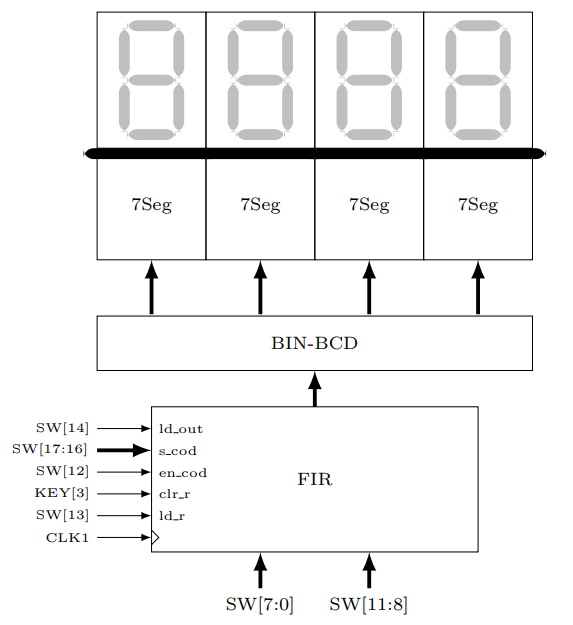
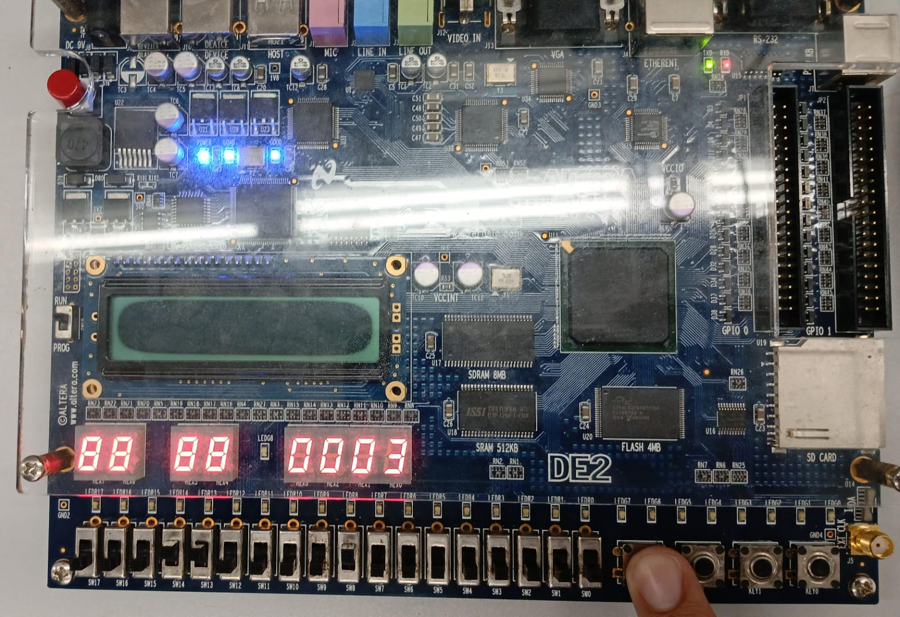
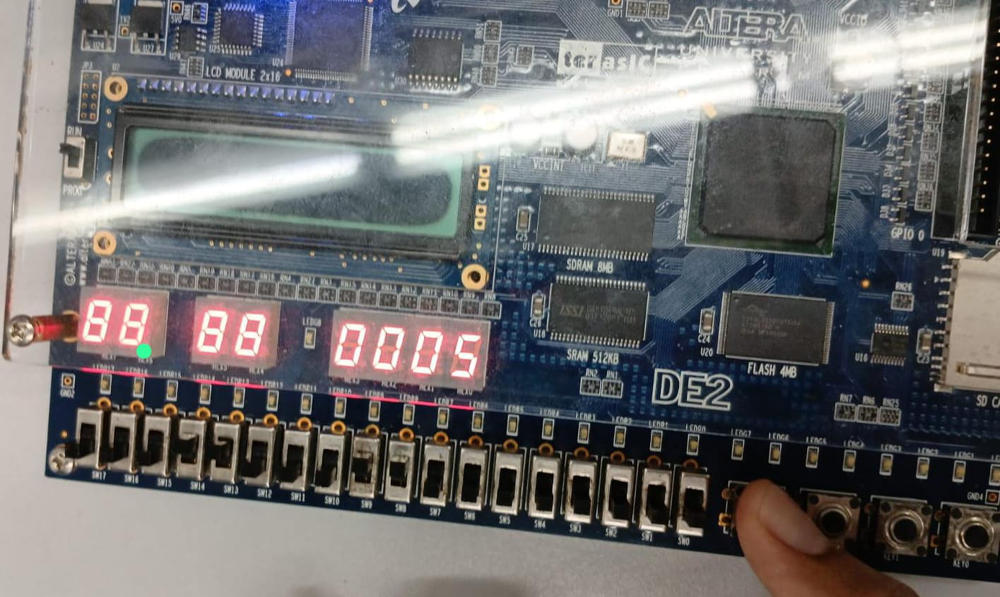

# Prática 5: Filtro FIR

## Introdução
O sexto projeto proposto foi fazer, em VHDL, a implementação de um filtro digital do tipo FIR (Finite Impulse Response), com 3 Taps (coeficientes).

_Figura 1: Esquemático do Filtro FIR Digital_

---

## Referencial Teórico

Para a concepção deste projeto RTL, precisamos de alguns blocos operacionais para as operações a serem executadas, e também saber como funciona a lógica de um filtro FIR, como será discutido abaixo.

### Filtro FIR
Um filtro FIR (Finite Impulse Response) recebe essa nomeclatura porque sua resposta ao impulso tem suporte temporal finito, podendo ser facilmente implementado digitalmente por uma operação de convolução, seja \(y[k]\) o sinal a ser filtrado e \(h[k]\) a resposta ao impulso do filtro, o sinal filtrado \(x[k]\) será dado pela equação:

$$
x[k] = y[k] \ast c[k] = \sum_{n = 0}^{M} c[n] y[k-n]
$$

para o caso com apenas três coeficientes \((M = 3)\), temos

$$
x[k] = y[k] \ast c[k] = \sum_{n = 0}^{2} c[n] y[k-n] = c[0] y[k] + c[1] y[k-1] + c[2]y[k-2]
$$

seja ainda o filtro dado na forma vetorial por

$$
c[k] = [c_0,c_1,c_2]
$$

finalmente obtemos

$$
x[k] = y[k] \ast h[k] = c_0 \ y[k] + c_1 \ y[k-1] + c_2 \ y[k-2]
$$

Os coeficientes do filtro serão previamente armazenados nos registradores e serão usados na operação de filtragem.

---

### Somador de n bits
Utilizando o componente somador completo de 1 bit, é possível, cascateando n somadores em série, fazer um somador justamente de n bits, que nesse caso \(n = 10\), como é mostrado abaixo:

_Figura 2: Esquemático do Somador de n Bits_

---

### Multiplicador de 8 bits
O circuito multiplicador é obtido de forma parecida, sua expressão lógica pode ser consultada no livro do Vahid [1], e é mostrado seu esquemático na figura abaixo.

_Figura 3: Esquemático do multiplicador de 4 bits_

O multiplicador de 4 bits resulta em uma saída de até 8 bits, então podemos usá-lo no nosso projeto, fazendo a multiplicação apenas entre os bits menos significativos, e para garantir um intervalo de representação entre 0 e 1024, podemos ainda expandir para um multiplicador de 5 bits, cujas expressões lógicas são obtidas abaixo:

| A₄ | A₃ | A₂ | A₁ | A₀ |   |   |   |   |
|----|----|----|----|----|---|---|---|---|
| × B₄ | B₃ | B₂ | B₁ | B₀ |   |   |   |   |
|     |     |     |     | B₀A₄ | B₀A₃ | B₀A₂ | B₀A₁ | B₀A₀ |
|     |     |     | B₁A₄ | B₁A₃ | B₁A₂ | B₁A₁ | B₁A₀ |   |
|     |     | B₂A₄ | B₂A₃ | B₂A₂ | B₂A₁ | B₂A₀ |   |   |
|     | B₃A₄ | B₃A₃ | B₃A₂ | B₃A₁ | B₃A₀ |   |   |   |
| B₄A₄ | B₄A₃ | B₄A₂ | B₄A₁ | B₄A₀ |   |   |   |   |

Produtos parciais corretamente alinhados e ordenados para multiplicação binária de 5 bits.

---

Agora temos as expressões para cada bit de saída do resultado da multiplicação:

\begin{cases}
P_0 = A_0B_0 \\  
P_1 = A_1B_0 + A_0B_1 \\  
P_2 = A_2B_0 + A_1B_1 + A_0B_2 \\  
P_3 = A_3B_0 + A_2B_1 + A_1B_2 + A_0B_3 \\  
P_4 = A_0B_4 + A_3B_1 + A_2B_2 + A_1B_3 + A_4B_0 \\  
P_5 = A_3B_2 + A_2B_3 + A_4B_1 \\  
P_6 = A_4B_2 + A_3B_3 + A_2B_4 \\  
P_7 = A_4B_3 + A_3B_4 \\  
P_8 = A_4B_4 \\  
\end{cases}

Porém as somas representadas nesses bits de saída precisam ser feitas utilizando somadores completos, e não por portas OR, pois podem carregar informação de carry in e carry out.

---

### Registrador de Carga Paralela

_Figura 4: Registrador de Carga Paralela_

---

### Codificador 2x4 com Enable
| eₙ | s1 | s0 | d3 | d2 | d1 | d0 |
|----|----|----|----|----|----|----|
| 1  | 0  | 0  | 0  | 0  | 0  | 1  |
| 1  | 0  | 1  | 0  | 0  | 1  | 0  |
| 1  | 1  | 0  | 0  | 1  | 0  | 0  |
| 1  | 1  | 1  | 1  | 0  | 0  | 0  |

$$
\begin{cases}
d_0 = e_n \cdot s_1' \cdot s_0' \\
d_1 = e_n \cdot s_1' \cdot s_0 \\
d_2 = e_n \cdot s_1 \cdot s_0' \\
d_3 = e_n \cdot s_1 \cdot s_0
\end{cases}
$$

---

### Conversor BIN→BCD de 4 Dígitos
$$
10000\ 00000_{bin} = 0101\ 0001\ 0010_{BCD} = 512_{decimal}
$$

Algoritmo **Double Dabble** utilizado para conversão binário → BCD.

---

### Display de 7 Segmentos
| Decimal | A | B | C | D | a | b | c | d | e | f | g |
|----------|---|---|---|---|---|---|---|---|---|---|---|
| 0 | 0 | 0 | 0 | 0 | 1 | 1 | 1 | 1 | 1 | 1 | 0 |
| 1 | 0 | 0 | 0 | 1 | 0 | 1 | 1 | 0 | 0 | 0 | 0 |
| 2 | 0 | 0 | 1 | 0 | 1 | 1 | 0 | 1 | 1 | 0 | 1 |
| 3 | 0 | 0 | 1 | 1 | 1 | 1 | 1 | 1 | 0 | 0 | 1 |
| 4 | 0 | 1 | 0 | 0 | 0 | 1 | 1 | 0 | 0 | 1 | 1 |
| 5 | 0 | 1 | 0 | 1 | 1 | 0 | 1 | 1 | 0 | 1 | 1 |
| 6 | 0 | 1 | 1 | 0 | 1 | 0 | 1 | 1 | 1 | 1 | 1 |
| 7 | 0 | 1 | 1 | 1 | 1 | 1 | 1 | 0 | 0 | 0 | 0 |
| 8 | 1 | 0 | 0 | 0 | 1 | 1 | 1 | 1 | 1 | 1 | 1 |
| 9 | 1 | 0 | 0 | 1 | 1 | 1 | 1 | 1 | 0 | 1 | 1 |

\begin{cases}
$$
a = A + A'C +B'D' + BD \\
b = A + C'D' + CD + A'B' \\
c = A + BD' + CD + C' \\
d = A + B'C'D' + CD' + A'B'C + BC'D \\
e = B'C'D' + AC + AB + CD' \\
f = A + C'D' + BD' + BC' \\
g = A + B + C
$$
\end{cases}

---

## Materiais e Métodos

### Materiais
| Componente | Quantidade |
|-------------|-------------|
| FPGA Cyclone II | 1 |

---

### Métodos

Foram testadas três configurações de filtros: **média móvel**, **diferenciador** e **acumulador**.  
(segue o texto original completo…)

---

### Simulação no ModelSIM

| Tempo (ns) | Sinal | Valor |
|-------------|--------|-------|
| 0.00 | clk | Pulso periódico (0 → 1 a cada 0.125 ns) |
| 0.00 | clr_r | 1 |
| 0.00 | en_cod | 0 |
| 0.00 | ld_r | 0 |
| 0.00 | ld_out | 1 |
| 0.05 | clr_r | 0 |
| 0.10 | s_cod | "00" |
| 0.10 | en_cod | 1 |
| 0.10 | c | "0001" |
| 0.15 | en_cod | 0 |
| 0.30 | s_cod | "01" |
| 0.30 | en_cod | 1 |
| 0.30 | c | "0001" |
| 0.40 | en_cod | 0 |
| 0.50 | s_cod | "10" |
| 0.50 | en_cod | 1 |
| 0.50 | c | "0001" |
| 0.65 | en_cod | 0 |
| 0.80 | y | "0001" |
| 0.80 | ld_r | 1 |
| 1.10 | y | "0010" |
| 1.10 | ld_r | 1 |

Para afim de simular um filtro acumulador, como visto na seção de métodos, para comparar o resultado obtido.

Assim então, foi possível ver que, após definir todos os coeficientes, e colocando como entrada o sinal  
$y[k] = [0,1,2,2,2,2,2,\ldots]$,  
em cinco ciclos de clock, foi possível ver que o resultado final onde se estabilizou foi de  
$F[k] = 6$,  
que é um valor coerente para a soma estável quando $y[k] = 2$, tudo de acordo com a simulação em MATLAB mostrada na figura abaixo.  

A saída filtrada  
$F[k] = [0,1,2,3,5,6,6,6,\ldots]$  
em função do tempo é marcada em vermelho na figura abaixo:

  
_Figura: Simulação no Modelsim — Saída Filtrada_

---

Os códigos VHDL desenvolvidos para o projeto estão disponíveis no GitHub:

🔗 [https://github.com/PedroDS4/Laboratorio_de_Sistemas_Digitais/tree/main/Projeto6](https://github.com/PedroDS4/Laboratorio_de_Sistemas_Digitais/tree/main/Projeto6)

---

## Implementação na FPGA

Foi então realizada a simulação na FPGA, onde os pinos foram mapeados de acordo com a imagem **Figura Filtro_FIR**, e começamos definindo os coeficientes do filtro, com os seguintes comandos:

\begin{cases}
    c_{0,1,2} = SW[11:8]  \rightarrow 0001 \\
    s_{cod} = SW[17:16] \rightarrow 00 \\
    en_{cod} = SW[12] \rightarrow 1 \\
    c_{0,1,2} = SW[11:8] \rightarrow 0001 \\
    s_{cod} = SW[17:16] \rightarrow 01 \\
    en_{cod} = SW[12] \rightarrow 1 \\
    c_{0,1,2} = SW[11:8] \rightarrow 0001 \\
    s_{cod} = SW[17:16] \rightarrow 10 \\
    en_{cod} = SW[12] \rightarrow 1 \\
\end{cases}

depois de definir todos os coeficientes como sendo $c[k] = 1$, finalmente colocamos a entrada $y[k]$ e a carregamos, por fim carregando a saída

\begin{cases}
    y  = SW[7:4] \rightarrow 0001 \\
    ld_r SW[13] \rightarrow 1 \\
    ld_{out} = SW[14] \rightarrow 1 \\
    y  = SW[7:4] \rightarrow 0010 \\
\end{cases}

Então o sinal $y[k]$ ficou:

$$
y[k] = [0,0,0,1,2,2,2,2,2,2]
$$

Por fim, foi possível ver que a saída seguiu o padrão crescente esperado, se estabilizando em $6$, de modo que:

$$
F[k] = [0,1,3,5,6,6,6,6,6,6]
$$

Essa implementação é mostrada nas figuras a seguir:

  
_Figura: Implementação na FPGA — Instante 1_

  
_Figura: Implementação na FPGA — Instante 2_

E a implementação foi validada com o professor.

---

## Conclusão

O quinto projeto foi testado com sucesso, tanto na simulação temporal no Modelsim quanto na FPGA, com o funcionamento confirmado pelo professor. Assim, foi implementado o filtro FIR digital.
