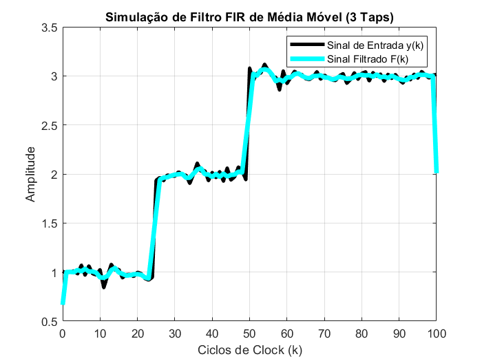
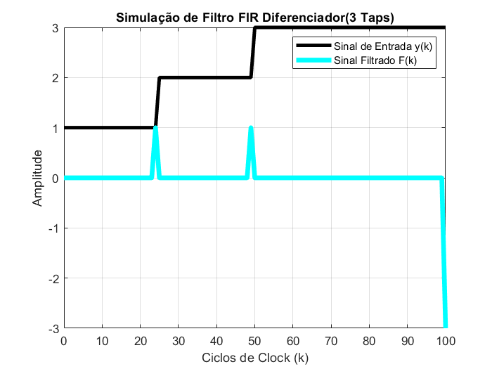

# Prática 6: Filtro FIR

## Introdução
O sexto projeto proposto foi fazer, em VHDL, a implementação de um filtro digital do tipo FIR(Finite Impulse Response), com 3 Taps(coeficientes).

## Referencial Teórico
Para a concepção deste projeto RTL, precisamos de alguns blocos operacionais para as operações a serem executadas, e também saber como funciona a lógica de um filtro FIR, como será discutido abaixo.

### Filtro FIR
Um filtro FIR(Finite Impulse Response) recebe essa nomeclatura porque sua resposta ao impulso tem suporte temporal finito, podendo ser facilmente implementado digitalmente por uma operação de convolução, seja $y[k]$ o sinal a ser filtrado e $h[k]$ a resposta ao impulso do filtro, o sinal filtrado $x[k]$ será dado pela equação

$$
x[k] = y[k] \ast c[k] = \sum_{n = 0}^{M} c[n] y[k-n]
$$

para o caso com apenas três coeficientes $(M = 3)$, temos

$$
x[k] = y[k] \ast c[k] = \sum_{n = 0}^{2} c[n] y[k-n] = c[0] y[k] + c[1] y[k-1] + c[2]y[k-2]
$$

seja ainda o filtro dado na forma vetorial por

$$
c[k] = [c_0,c_1,c_2]
$$

finalmente obtemos

$$
x[k] = y[k] \ast h[k] = c_0 \ y[k] + c_1 \ y[k-1] + c_2 \ y[k-2]
$$

Os coeficientes do filtro serão previamente armazenados nos registradores e serão usados na operação de filtragem.

### Somador de n bits
Utilizando o componente somador completo de 1 bit, é possível, cascateando n somadores em série, fazer um somador justamente de n bits, que nesse caso $n = 10$, como é mostrado abaixo

### Multiplicador de 8 bits
O circuito multiplicador é obtido de forma parecida, sua expressão lógica pode ser consultado no livro do Vahid, e é mostrado seu esquemático na figura abaixo.

O multiplicador de 4 bits resulta em uma saída de até 8 bits, então podemos usá-lo no nosso projeto, fazendo a multiplicação apenas entre os bits menos significativos, e para garantir um intervalo de reprsentação entre 0 e 1024, podemos ainda expandir para um multiplicador de 5 bits, cujas expressões lógicas são obtidas abaixo:

| | A4 | A3 | A2 | A1 | A0 | | | | |
|---|---|---|---|---|---|---|---|---|---|
| $\times$ | B4 | B3 | B2 | B1 | B0 | | | | |
| | | | | | B0A4 | B0A3 | B0A2 | B0A1 | B0A0 |
| | | | | B1A4 | B1A3 | B1A2 | B1A1 | B1A0 | |
| | | | B2A4 | B2A3 | B2A2 | B2A1 | B2A0 | | |
| | | B3A4 | B3A3 | B3A2 | B3A1 | B3A0 | | | |
| | B4A4 | B4A3 | B4A2 | B4A1 | B4A0 | | | | |
| **Res** | **P8** | **P7** | **P6** | **P5** | **P4** | **P3** | **P2** | **P1** | **P0** |

Agora temos as expressões para cada bit de saída do resultado da multiplicação, assim temos:

1. $P_0 = A_0B_0$
2. $P_1 = A_1B_0 + A_0B_1$
3. $P_2 = A_2B_0 + A_1B_1 + A_0B_2$
4. $P_3 = A_3B_0 + A_2B_1 + A_1B_2 + A_0B_3$
5. $P_4 = A_0B_4 + A_3B_1 + A_2B_2 + A_1B_3 + A_4B_0$
6. $P_5 = A_3B_2 + A_2B_3 + A_4B_1$
7. $P_6 = A_4B_2 + A_3B_3 + A_2B_4$
8. $P_7 = A_4B_3+A_3B_4$ 
9. $P_8 = B_4 A_4$

Porém as somas representadas nesses bits de saída precisam ser feitas utilizando somadores completos, e não por portas OR, como normalmente são feitas, pois podem carregar informação de carrie in e carrie out.

### Codificador 2x4 com Enable
Como iremos multiplexar as colunas da matriz, precisamos de um decodificador 3x8 para dizer qual coluna está ativa no momento, para isso, podemos usar um decodificador, que irá receber a chave SW, que é uma entrada do valor a ser exibido e o enable que estará sempre em nível alto.
A tabela verdade deste decodificador é mostrada abaixo

| e_n | s1 | s0 | d3 | d2 | d1 | d0 |
|---|---|---|---|---|---|---|
| 1 | 0 | 0 | 0 | 0 | 0 | 1 |
| 1 | 0 | 1 | 0 | 0 | 1 | 0 |
| 1 | 1 | 0 | 0 | 1 | 0 | 0 |
| 1 | 1 | 1 | 1 | 0 | 0 | 0 |

Assim, por soma de produtos conseguimos achar a expressão lógica corresponde de cada saída $d$, dadas por

$$
\begin{cases} d_0 = e_n \cdot s_1' \cdot s_0' \\ 
d_1 = e_n \cdot s_1' \cdot s_0 \\ 
d_2 = e_n \cdot s_1 \cdot s_0' \\ 
d_3 = e_n \cdot s_1 \cdot s_0 
\end{cases}
$$

### Conversor BIN->BCD de 4 Dígitos
Para mostrar os valores obtidos pela filtragem no circuito, precisamos de um conversor que converta os 10 bits de saída para serem exibidos em um display de 7 segmentos.

Para isso, é possível fazer, com lógica combinacional, um circuito que converta um número de 10 bits em 4 dígitos, Milhar, centena, dezena e unidade, de modo que, de acordo com a equação. Nessa representação tem 4 nibble, onde cada um tem 4 bits.

$$
10000 \ 00000_{bin} = 0101 \ 0001 \ 0010 _{BCD} = 512_{decimal}
$$

Para isso vamos utilizar o algoritmo Double Dabble. Nesse algoritmo, utilizaremos 10 estágios, onde cada estágio deslocamos 1 bit do número binário para representar o número em BCD, adicionando 3 se for necessário.

Primerio passo inicia cada bit dos 16 bits com zero da representação em BCD. Com o número original em binário vamos deslocar para esquerda cada bit do número para os 16 bits da representação em BCD, começando do bit mais significativo. Vai deslocando cada bit, mas, quando no nibble mais o número for maior que 4 é necessário somar 3 em binário no mesmo nibble. Continua isso até o número original ou totalmente deslocado.

## Materiais e Métodos

### Materiais
| Componente | Quantidade |
|---|---|
| FPGA Cyclone II | 1 |

### Métodos
Para testar o circuito, foram utilizadas duas configurações diferentes de filtros, uma baseada em um filtro de média móvel com 3 taps, e uma outra baseada em um diferenciador de primeira ordem.

#### Filtro de Média Móvel
Para o filtro de média móvel, o sinal $c(k)$ se torna

$$
c(k) = \frac{1}{3} [1,1,1]
$$

assim a saída será a média das 3 ultimas amostras do sinal de entrada, sendo uma configuração útil na eliminação de ruído descorrelacionado.

O gráfico abaixo mostra o resultado dessa filtragem para um sinal considerando ainda um ruído AWGN de variância $\sigma = 0.05$, em 100 ciclos de um clock simulado no matlab.

#### Filtro Diferenciador
Para o segundo teste, foi utilizado os coeficientes como sendo de um filtro diferenciador, onde o sinal $c(k)$ se torna

$$
c(k) = [1,-1,0]
$$

que também pode ser visto como um filtro passa-altas, assim o resultado da filtragem resulta em

$$
F(k) = y[k] - y[k-1]
$$

que é uma equação de diferenças de primeira ordem, aproximando a ideia da derivada numérica para um sinal digital, como é mostrado no gráfico abaixo

#### Filtro de Acumulador
Por fim, para o caso mais realista onde podemos usar apenas coeficientes inteiros, que é o que será executado no sistema digital, foi testado um filtro acumulador, cujos coeficientes do filtro $c(k)$ se tornam

$$
c(k) = [1,1,1]
$$

cuja equação é dada por

$$
F(k) = y[k] + y[k-1] + y[k-2]
$$

podemos ver que ao longo do tempo, a saída filtrada irá acumular o valor das somas passadas, e se a entrada se estabilizar, ela também estabilizará.

## Simulação no ModelSIM
Para realizar a simulação, foi criado um arquivo script .do, onde definimos a seguinte sequência de comandos

| Tempo (ns) | Sinal | Valor |
|---|---|---|
| 0.00 | clk | Pulso periódico (0 $\rightarrow$ 1 a cada 0.125 ns) |
| 0.00 | clr_r | 1 |
| 0.00 | en_cod | 0 |
| 0.00 | ld_r | 0 |
| 0.00 | ld_out | 1 |
| 0.05 | clr_r | 0 |
| 0.10 | s_cod | "00" |
| 0.10 | en_cod | 1 |
| 0.10 | c | "0001" |
| 0.15 | en_cod | 0 |
| 0.30 | s_cod | "01" |
| 0.30 | en_cod | 1 |
| 0.30 | c | "0001" |
| 0.40 | en_cod | 0 |
| 0.50 | s_cod | "10" |
| 0.50 | en_cod | 1 |
| 0.50 | c | "0001" |
| 0.65 | en_cod | 0 |
| 0.80 | y | "0001" |
| 0.80 | ld_r | 1 |
| 1.10 | y | "0010" |
| 1.10 | ld_r | 1 |

Para afim de simular um filtro acumulador, como visto na seção de métodos, para comparar o resultado obtido. Assim então, foi possível ver que, após definir todos os coeficientes, e colocando como entrada o sinal $y[k] = [0,1,2,2,2,2,2,...]$, em cinco ciclos de clock, foi possivel ver que o resultado final onde se estabilizou foi de $F[k] = 6$, que é um valor coerente para a soma estável quando $y[k] = 2$. A saída filtrada $F[k] = [0,1,2,3,5,6,6,6,...]$ em função do tempo é marcada em vermelho na figura abaixo: 

Os códigos VHDL desenvolvidos para o projeto estão disponíveis no github, pelo link abaixo:
[Projeto 6 no GitHub](https://github.com/PedroDS4/Laboratorio_de_Sistemas_Digitais/tree/main/Projeto6)

## Implementação Na FPGA
Foi então realizada a simulação na FPGA, onde os pinos foram mapeados de acordo com a imagem do filtro FIR, e começamos definindo os coeficientes do filtro, com os seguintes comandos:

$$
\begin{cases} 
c_{0,1,2} = SW[11:8] \rightarrow 0001 \\
s_{cod} = SW[17:16] \rightarrow 00 \\
en_{cod} = SW[12] \rightarrow 1 \\
c_{0,1,2} = SW[11:8] \rightarrow 0001 \\
s_{cod} = SW[17:16] \rightarrow 01 \\
en_{cod} = SW[12] \rightarrow 1 \\
c_{0,1,2} = SW[11:8] \rightarrow 0001 \\
s_{cod} = SW[17:16] \rightarrow 10 \\
en_{cod} = SW[12] \rightarrow 1 
\end{cases}
$$

depois de definir todos os coeficientes como sendo $c[k] = 1$, finalmente colocamos a entrada $y[k]$ e a carregamos, por fim carregando a saída

$$
\begin{cases} 
y = SW[7:4] \rightarrow 0001 \\
ld_r = SW[13] \rightarrow 1 \\
ld_{out} = SW[14] \rightarrow 1 \\
y = SW[7:4] \rightarrow 0010 
\end{cases}
$$

então $y$ ficou

$$
y[k] = [0,0,0,1,2,2,2,2,2,2]
$$

por fim foi possível ver que a saída seguiu o padrão crescente esperado, se estabilizando em 6, de modo que 

$$
F[k] = [0,1,3,5,6,6,6,6,6,6]
$$

essa implementação é mostrada abaixo

e a implementação foi validada com o professor.

## Conclusão
O sexto projeto foi testado com sucesso, tanto na simulação temporal no modelsim tanto na FPGA, com o funcionamento confirmado pelo professor, e assim foi implementado o filtro FIR digital.
