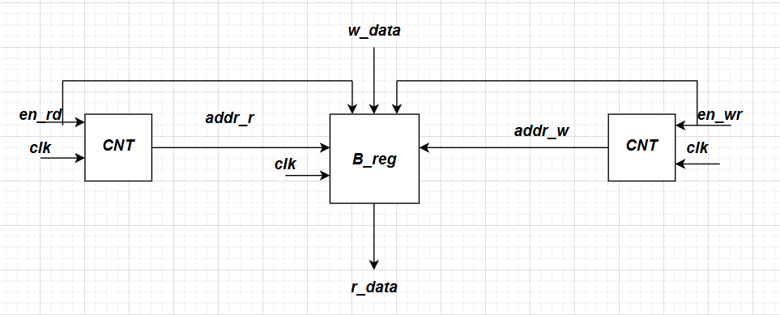
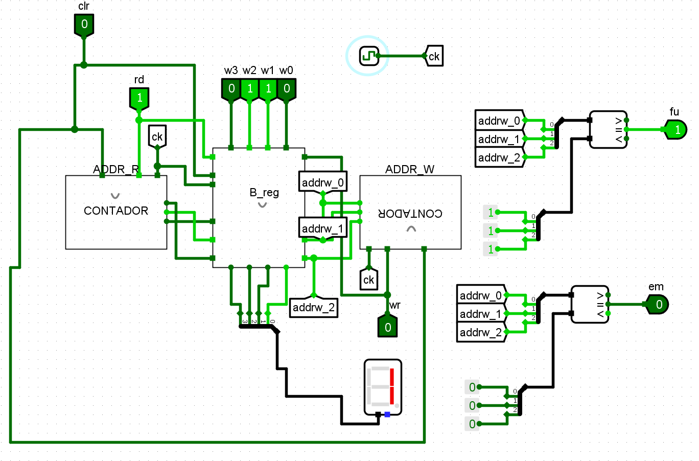

# Prática 7: FIFO

## Introdução
Para o sétimo projeto da disciplina, foi proposto a elaboração de um projeto de uma estrutura de dados em fila, mais conhecida como FIFO(First Input, First Output), onde o primeiro elemento a ser gravado, é o primeiro a ser lido, como uma fila ideal.

## Referencial Teórico
Para a concepção do projeto, precisamos de alguns blocos operacionais para a lógica da FIFO, principalmente de estruturas de memória, como um banco de registradores ou uma memória RAM, até também um somador de 4 bits e registradores simples, ou diretamente um contador, como será utilizado, pros ponteiros da FIFO. 

### Comparador Sequencial de 1 bit
Um comparador sequencial de 1 bit é um componente capaz de verificar se uma cadeia de bits é igual, menor ou maior que uma referência, tendo esses três sinais de saída para e sinais de entradas correspondes as cadeias mais a esquerda.
Podemos montar uma tabela para um comparador desse tipo, e em seguida, podemos utilizar a soma de produtos para obter expressões lógicas para esse comparador, e o comparador de 10 bits pode ser feito cascateando vários desses comparadores.
As expressões lógicas para as saídas de comparação são mostradas abaixo:

Um comparador sequencial de 1 bit é um circuito capaz de comparar dois bits ($A$ e $B$) e, com base no resultado da comparação dos bits menos significativos (fornecidos pelas entradas de propagação), determinar se a cadeia de bits representada por $A$ é maior, menor ou igual à representada por $B$.

Esse comparador possui três entradas de propagação:
* `in_gt`: sinal indica que, até o bit anterior, $A > B$;
* `in_eq`: sinal indica que, até o bit anterior, $A = B$;
* `in_lt`: sinal indica que, até o bit anterior, $A < B$.

As saídas indicam o resultado da comparação após considerar o bit atual e são:
* `out_gt`: resultado final $A > B$;
* `out_eq`: resultado final $A = B$;
* `out_lt`: resultado final $A < B$.

A Tabela abaixo apresenta a tabela verdade de um comparador sequencial de 1 bit.

| A | B | `in_gt` | `in_eq` | `in_lt` | `out_gt` | `out_eq` | `out_lt` |
|---|---|---|---|---|---|---|---|
| 0 | 0 | 0 | 1 | 0 | 0 | 1 | 0 |
| 0 | 0 | 1 | 0 | 0 | 1 | 0 | 0 |
| 0 | 0 | 0 | 0 | 1 | 0 | 0 | 1 |
| 0 | 1 | x | x | x | 0 | 0 | 1 |
| 1 | 0 | x | x | x | 1 | 0 | 0 |
| 1 | 1 | 0 | 1 | 0 | 0 | 1 | 0 |
| 1 | 1 | 1 | 0 | 0 | 1 | 0 | 0 |
| 1 | 1 | 0 | 0 | 1 | 0 | 0 | 1 |

Com base na tabela, podemos escrever as expressões lógicas para cada saída utilizando a forma de soma de produtos:
$$
out_gt = (A \cdot \overline{B}) + (\overline{A} \cdot \overline{B} \cdot \text{in\_gt}) + (A \cdot B \cdot \text{in\_gt}) \\
out_eq = (\overline{A} \cdot \overline{B} + A \cdot B) \cdot \text{in\_eq} \\
out_lt = (\overline{A} \cdot B) + (\overline{A} \cdot \overline{B} \cdot \text{in\_lt}) + (A \cdot B \cdot \text{in\_lt})
$$

Essas expressões são utilizadas na construção de comparadores maiores (por exemplo, de 10 bits), conectando comparadores de 1 bit em cascata da direita para a esquerda (do bit menos significativo ao mais significativo), propagando os sinais de comparação apropriados.

### Somador de 4 bits
Utilizando o componente somador completo de 1 bit, é possível, cascateando n somadores em série, fazer um somador justamente de n bits, que nesse caso $n = 4$, como é mostrado abaixo

### Flip-Flop D
O flip-flop D é um circuito muito utilizado na construção de registradores simples, e tem a função de armazenar bits de forma seletiva.
A equação característica do flip-flop D é dada por

$$
Q^{i+1} = D \cdot clk ^{\uparrow}
$$

ou seja, ele é igual a sua entrada, nas bordas de subida do sinal de relógio.

A figura do flip-flop D é mostrada abaixo

### Registradores
Um registrador é um circuito feito para guardar o valor de um bit no seu interior até que ele mude, para isso precisamos de circuitos flip flops e também multiplexadores para controlar quando um registrador deve ser alterado(carregado) e quando deve permanecer com o mesmo valor.
Podemos implementar um registrador utilizando um Flip-flop D e um multiplexador, como é mostrado na figura abaixo.

A chave seletora do mux de um registrador é chamada de *load*, e seu nome tem justamente o significado de carregar um valor para a saída do registrador, somente quando essa chave for ativa.

A equação do multiplexador é dada por

$$
D = \overline{ load } \cdot Q + load \cdot I
$$

Porém a saída do registrador é o valor da entrada, apenas nas bordas de subida, assim

$$
Q^{i+1} = (\overline{ load } \cdot Q^i + load \cdot I) \cdot clk^{\uparrow}
$$

Ou seja, o valor $Q$ guardado no registrador so vai ser determinado pela entrada I quando a entrada $load$ estiver ativa e houver uma borda de subida, e isso é a forma fundamental de armazenamento de bits, que é conhecido como registrador de carga paralela.

### Decodificador 3x8 com Enable
Como iremos multiplexar as colunas da matriz, precisamos de um decodificador 3x8 para dizer qual coluna está ativa no momento, para isso, podemos usar um decodificador, que irá receber a chave SW, que é uma entrada do valor a ser exibido e o enable que estará sempre em nível alto.
A tabela verdade deste decodificador é mostrada abaixo

| e_n | s3 | s2 | s1 | s0 | d7 | d6 | d5 | d4 | d3 | d2 | d1 | d0 |
|---|---|---|---|---|---|---|---|---|---|---|---|---|
| 1 | 0 | 0 | 0 | 0 | 0 | 0 | 0 | 0 | 0 | 0 | 0 | 1 |
| 1 | 0 | 0 | 0 | 1 | 0 | 0 | 0 | 0 | 0 | 0 | 1 | 0 |
| 1 | 0 | 0 | 1 | 0 | 0 | 0 | 0 | 0 | 0 | 1 | 0 | 0 |
| 1 | 0 | 0 | 1 | 1 | 0 | 0 | 0 | 0 | 1 | 0 | 0 | 0 |
| 1 | 0 | 1 | 0 | 0 | 0 | 0 | 0 | 1 | 0 | 0 | 0 | 0 |
| 1 | 0 | 1 | 0 | 1 | 0 | 0 | 1 | 0 | 0 | 0 | 0 | 0 |
| 1 | 0 | 1 | 1 | 0 | 0 | 1 | 0 | 0 | 0 | 0 | 0 | 0 |
| 1 | 0 | 1 | 1 | 1 | 1 | 0 | 0 | 0 | 0 | 0 | 0 | 0 |
| X | X | X | X | X | 0 | 0 | 0 | 0 | 0 | 0 | 0 | 0 |

Assim, por soma de produtos conseguimos achar a expressão lógica corresponde de cada saída $d$, dadas por

$$
\begin{cases}
    d_0 = e_n \cdot s_2' \cdot s_1' \cdot s_0' \\
    d_1  = e_n \cdot s_2' \cdot s_1' \cdot s_0 \\
    d_2 = e_n \cdot s_2' \cdot s_1 \cdot s_0'\\
    d_3 = e_n \cdot s_2' \cdot s_1 \cdot s_0 \\
    d_4 = e_n \cdot s_2 \cdot s_1' \cdot s_0'\\
    d_5 = e_n \cdot s_2 \cdot s_1' \cdot s_0 \\
    d_6 = e_n \cdot s_2 \cdot s_1 \cdot s_0' \\
    d_7 = e_n \cdot s_2 \cdot s_1 \cdot s_0 \\
\end{cases}
$$

### Banco de Registradores
Este componente representa a memória da pilha, onde irá ser guardado o dado de entrada $w_{data}$, ou de onde irá ser tirado o dado de leitura $r_{data}$.
Para fazer um banco de registradores sem barramento, precisamos colocar vários registradores em paralelo, com alguns multiplexadores para dizer qual saída ou qual entrada irá ficar em destaque.

A figura abaixo mostra o esquemático do componente do banco de registradores

## Materiais e Métodos

### Materiais

| Componente | Quantidade |
|---|---|
| CI 74LS161 (Contador) | 2 |
| CI 74LS170 (Memória 4x4) | 1 |
| CI 74HC48 (Conversor para Display) | 1 |
| 1 Display de 7 Segmentos Catódico | 1 |
| DIP SWITCH 4 bits | 2 |
| Fonte de tensão | 1 |
| Gerador de sinais | 1 |
| Led | 1 |
| Resistor para led(550 $\Omega$) | 1 |
| Resistores Pull Down (1 k$\Omega$) | 8 |

### Métodos
Para a implementação desse projeto da fila, foi utilizada uma abordagem sem controlador(máquina de estados), uma vez que a lógica de armazenamento da fila é muito simples e pode ser feita apenas com os blocos de memória e contadores de 8 bits.

## Implementação no Logisim
Para testar se a lógica do circuito estava correta, foi feita uma implementação no software LogiSIM, onde os componentes descritos na seção anterior foram implementados do zero a partir de portas lógicas binárias e flip-flops D de 1 bit, e o circuito foi montado com dois contadores e um banco de regisradores, como é mostrado na imagem abaixo:

O arquivo **.circ** para a simulação do circuito se encontra no link abaixo do github:
[Link para o Projeto 7](https://github.com/PedroDS4/Laboratorio_de_Sistemas_Digitais/tree/main/Projeto7)

## Implementação em Protoboard
A implementação em protoboard não foi concluída com sucesso, uma vez que o circuito não se comportou da forma desejada, provavelmente devido à um erro de montagem utilizando os CI's comerciais ou até mesmo um problema de hardware.

## Conclusão
Foram testados todas as transições possíveis de estados em ambas implementações, e foi verficado que o circuito seguiu corretamente a lógica do armazenamento em fila, assim pudemos confirmar o funcionamento do sétimo projeto da disciplina, no LogiSIM.
