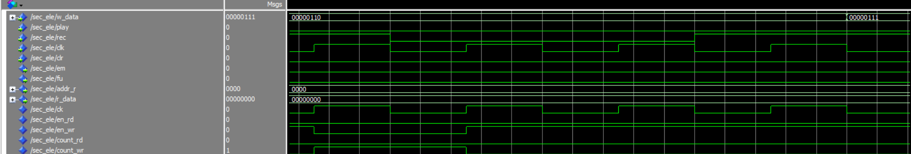
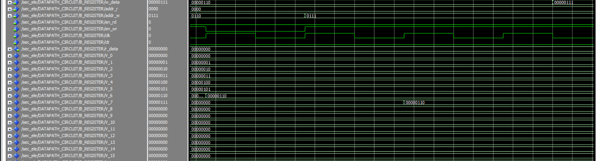
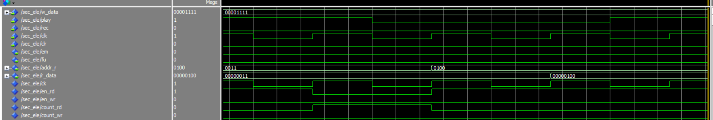

# Prática 8: Secretária Eletrônica

## Introdução
O oitavo e último projeto proposto foi fazer, em VHDL, a implementação de uma secretária eletrônica para reprodução e gravação automática de mensagens, utilizando estruturas de dados como banco de registradores, e contadores com máquina de estados para fazerem a transição das reproduções e gravações.

## Referencial Teórico
Para a concepção deste projeto RTL, precisamos de alguns blocos operacionais para as operações a serem executadas, e também saber como funciona a lógica de um filtro FIR, como será discutido abaixo.

### Somador de n bits
Utilizando o componente somador completo de 1 bit, é possível, cascateando n somadores em série, fazer um somador justamente de n bits, que nesse caso $n = 10$, como é mostrado abaixo.

### Conversor BIN->BCD de 4 Dígitos
Para mostrar os valores obtidos pela filtragem no circuito, precisamos de um conversor que converta os 10 bits de saída para serem exibidos em um display de 7 segmentos.

Para isso, é possível fazer, com lógica combinacional, um circuito que converta um número de 10 bits em 4 dígitos, Milhar, centena, dezena e unidade, de modo que, de acordo com a equação. Nessa representação tem 4 nibble, onde cada um tem 4 bits.

$$
10000 \ 00000_{bin} = 0101 \ 0001 \ 0010 _{BCD} = 512_{decimal}
$$

Para isso vamos utilizar o algoritmo Double Dabble. Nesse algoritmo, utilizaremos 10 estágios, onde cada estágio deslocamos 1 bit do número binário para representar o número em BCD, adicionando 3 se for necessário.

Primeiro passo inicia cada bit dos 16 bits com zero da representação em BCD. Com o número original em binário vamos deslocar para esquerda cada bit do número para os 16 bits da representação em BCD, começando do bit mais significativo. Vai deslocando cada bit, mas, quando no nibble mais o número for maior que 4 é necessário somar 3 em binário no mesmo nibble. Continua isso até o número original ou totalmente deslocado.

### Divisor de Frequência
O divisor de frequência é um circuito com Flip-flop JK, que tem a característica de dividir a frequência do sinal de clock da entrada por dois.
A configuração do flip-flop JK como dobrador de frequência é mostrada na figura abaixo:

Aplicando a equação característica do flip-flop nessa configuração, temos 

$$
Q^{i+1} = 1 \cdot \overline{Q^i} + \overline{1} \cdot Q^i = \overline{Q^i} \cdot clk^{\uparrow}
$$

Ou seja, se demora um período $T$ para a borda de subida acontecer, irá demorar $T$ segundos para a saída ir do positivo pro negativo ou vice-versa, ou seja, um ciclo completo agora se dará em um período de $2T$, assim, se o período é dobrado, a frequência é dividida por 2, então temos finalmente a relação fundamental do divisor de frequência:

$$
\omega_Q = \frac{\omega_{clk}}{2}
$$

### Datapath
Foi desenvolvida uma arquitetura para o datapath baseado nas operações de ler e grava da secretária eletrônica. O diagrama de blocos do datapath é mostrado abaixo:

### Máquina de Estados (Controlador)
A Máquina de Estados abaixo exemplifica como funciona a LIFO.

No estado inicial a Secretária Eletrônica começa com os valores todos zerados, por isso o clear (clr_life) começa com o nível lógico baixo. Após isso, o próximo estado é o I (estado de repouso), nesse estado que vai ser avaliado qual a operação a ser feita. Se o sinal rec for nível lógico alto, vai para o estado R (estado de gravação), aqui será avaliado se a Secretária está com a memória cheia, caso esteja, fu com nível lógico alto, a Secretária volta para o estado repouso, caso fu esteja com nível lógico baixo, a Secretária vai para o estado Nr onde será gravado a mensagem. De for similar, funciona para o ler a mensagem. Quando está no estado inicial e o nível de play for alto, a Secretária irá para o estado P (estado para ler a mensagem), caso esteja sem mensagem, em igual a nível lógico alto, será voltado para o estado de repouso. Caso em for nível lógico baixo, a Secretária irá para o estado Np, onde será lido a mensagem. 

## Materiais e Métodos

### Materiais
| Componente | Quantidade |
|---|---|
| FPGA Cyclone II | 1 |

### Métodos
Para testar o circuito, foi utilizado uma abordagem de gravação em série de mensagens, seguida de uma reprodução em sequência de todas as mensagens guardadas na memória, foi utilizado a sequencia lógica de mensagens de 0 a 15, e depois foram reproduzidas todas essas mensagens, de acordo com a sequência.

## Simulação no ModelSIM
A simulação funcional do sistema foi realizada por meio de um script *.do* no ModelSim, responsável por gerar os sinais de clock, reset e comandos de controle necessários para exercitar a máquina de estados e o banco de memória.

Inicialmente, o sinal de `clk` foi configurado como uma onda periódica com período de 0,5 ns, garantindo a correta sincronização dos processos sequenciais. Em seguida, o sinal de reset (`clr`) foi ativado por um intervalo de 1 ns, colocando o sistema em seu estado inicial.

Após a liberação do reset, a etapa de gravação foi iniciada. Para cada mensagem, o sinal `rec` foi ativado por um ciclo de clock, enquanto o barramento `w_data` recebia um valor binário específico. Esse procedimento foi repetido sequencialmente para 16 valores distintos, correspondentes aos números de 0 a 15 em formato binário de 8 bits, permitindo o preenchimento completo da memória.

Concluída a gravação, iniciou-se a fase de reprodução. O sinal `play` foi ativado por pulsos temporizados de curta duração, suficientes para acionar a máquina de estados e permitir a leitura sequencial dos dados armazenados. Durante essa fase, o contador de leitura foi incrementado automaticamente a cada ciclo, até que a condição de fim de memória fosse atingida.

A simulação foi executada por tempo suficiente para observar integralmente os processos de gravação e leitura, possibilitando a verificação do correto funcionamento do controlador e do banco de registradores.

E a para a leitura das mensagens, a simulação se mostrou consistente e apresentou as mensagens em cada posição de memória correta, na saída.

Os códigos VHDL desenvolvidos para o projeto estão disponíveis no github, pelo link abaixo:
[Link para o Projeto 8](https://github.com/PedroDS4/Laboratorio_de_Sistemas_Digitais/tree/main/Projeto8)

## Implementação na FPGA
Foi então realizada a simulação na FPGA, onde os pinos foram mapeados de acordo com a configuração do manual da Altera, para a placa Cyclone II, e foram testadas tanto a gravação quanto a leitura dos dados na secretária eletrônica, e a implementação foi validada com o professor.

## Conclusão
O oitavo projeto da disciplina foi concluído com exito, onde foi possível observar o comportamente correto da secretária eletrônica proposta, com a validação do professor na implementação prática e computacional.
